# **General Scope**


# Table of Contents

1. [C1 - Neural Networks and Deep Learning](#c1---neural-networks-and-deep-learning)
   - [C1W1](#c1w1)
   - [C1W2](#c1w2)
   - [C1W3](#c1w3)
   - [C1W4](#c1w4)
2. [C2 - Improving Deep Neural Networks: Hyperparameter Tuning, Regularization, and Optimization](#c2---improving-deep-neural-networks-hyperparameter-tuning-regularization-and-optimization)
   - [C2W1 Regularizing NN](#c2w1-regularizing-nn)
   - [C2W2 Optimizing NN Training](#c2w2-optimizing-nn-training)
   - [C2W3 Hyperparameters Tuning](#c2w3-hyperparameters-tuning)
3. [C3 - Structuring ML Project](#c3---structuring-ml-project)
   - [C3W1](#c3w1)
   - [C3W2](#c3w2)
4. [C4 - Convolutional Neural Network](#c4---convolutional-neural-network)
   - [C4W1 Fundation of ConV NN](#c4w1-fundation-of-conv-nn)
   - [C4W2 Deep Learning Classic Convolution Model](#c4w2-deep-learning-classic-convolution-model)
   - [C4W3 Object Detection](#c4w3-object-detection)
   - [C4W4 Case Study](#c4w4-case-study)
5. [C5 - Sequential Model](#c5---sequential-model)
   - [C5W1 RNN](#c5w1-rnn)
   - [C5W2 Natural Language Process & Word Embedding](#c5w2-natural-language-process--word-embedding)
   - [C5W3 Sequence Model & Attention Mechanism](#c5w3-sequence-model--attention-mechanism)
   - [C5W4 Self-Attention](#c5w4-self-attention)

# **C1 - Neural Nectworks and Deep Learning**

## C1W1

scale: both big data set and big nn (hidden layers, unit, etc)


**Geoffery Hinton**

see if you can find an advisor who has beliefs similar to yours. Because if you work on stuff that your advisor feels deeply about, you'll get a lot of good advice and time from your advisor. If you work on stuff your advisor's not interested in, all you'll get is, you get some advice, but it won't be nearly so useful.

## C1W2

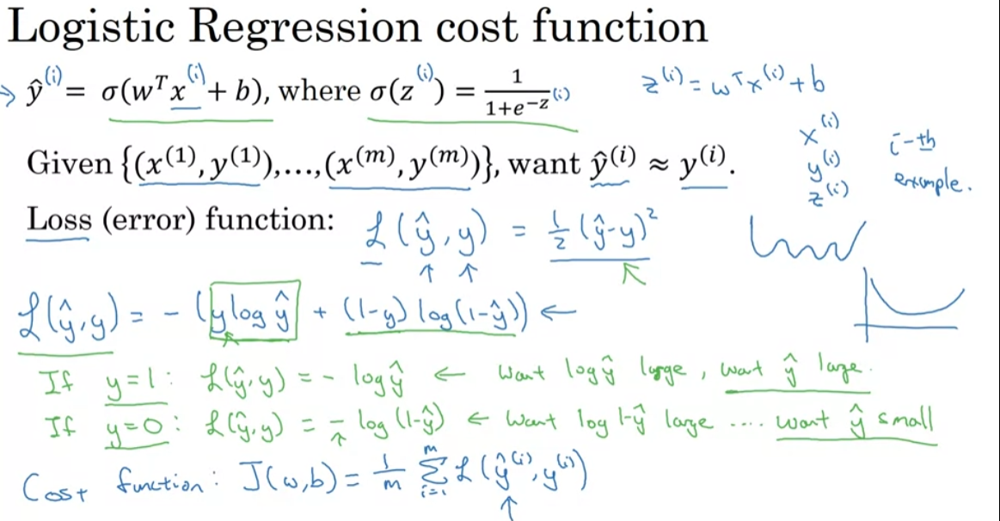
numpy product, np.dot(a,b) and a*b is different

## C1W3

hidden layer: hidden-> not in input data
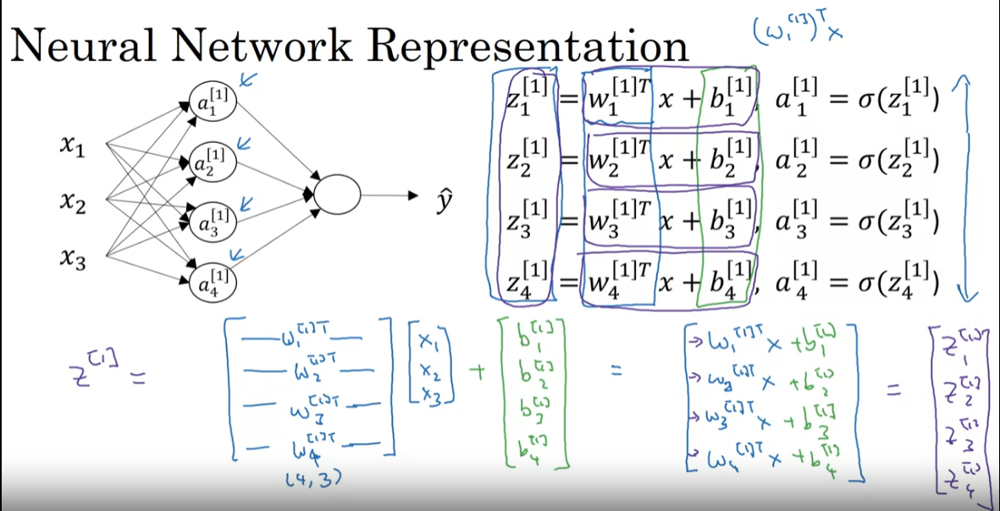


why use none-linear Activation Function?A


Backpropagation
[https://jonaslalin.com/2021/12/10/feedforward-neural-networks-part-1/](https://jonaslalin.com/2021/12/10/feedforward-neural-networks-part-1/)

[https://jonaslalin.com/2021/12/21/feedforward-neural-networks-part-2/](https://jonaslalin.com/2021/12/21/feedforward-neural-networks-part-2/)


```python
for epoch in epochs:
    ...
    A2, cache = forward_propagation(X, parameters)
    cost = compute_cost(A2, Y)
    grads = backward_propagation(parameters, cache, X, Y)
    parameters = update_parameters(parameters, grads)
```

## C1W4

why DEEP learning
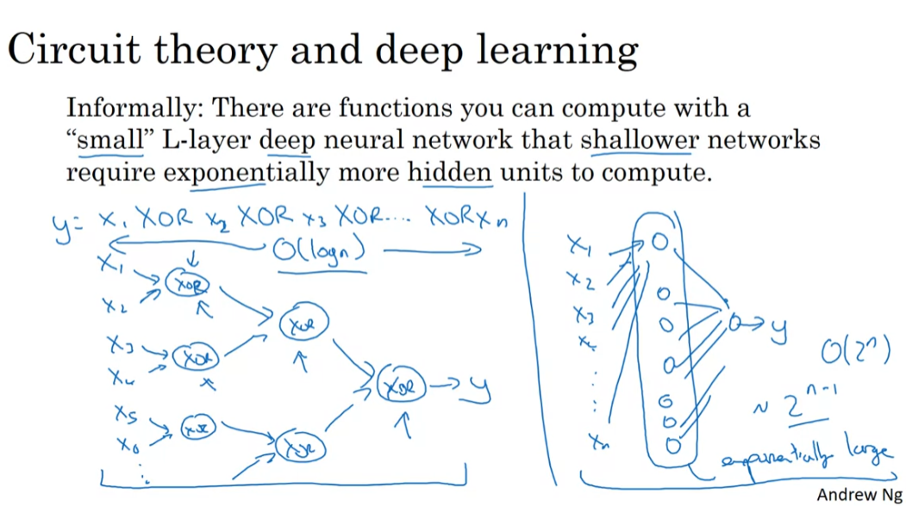
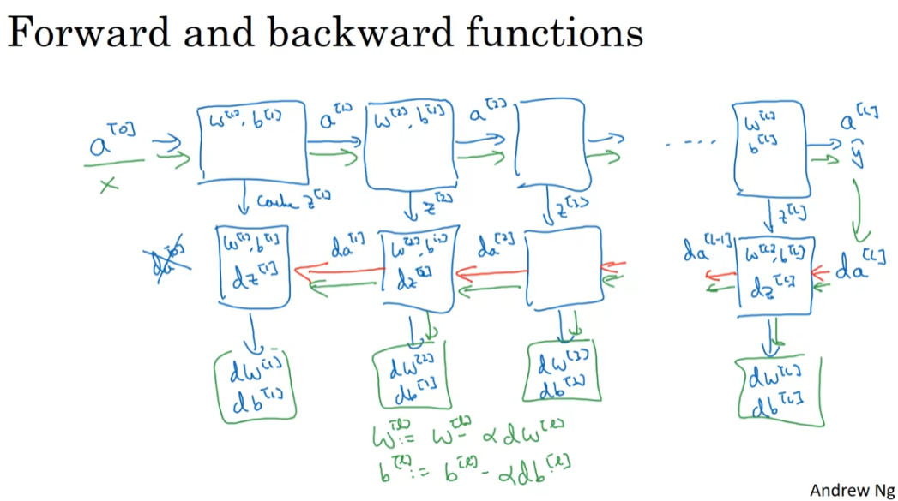


---
---

# **C2 - Improving Deep Neural Networks: Hyperparameter Tuning, Regularization and Optimization**

## C2W1

### Regularizating NN

Train / Dev / Test Set


Bias and Varias


Regularization Methods (reduce overfitting):

1. Add lambd(regulzarization params): balence weight, so individual w can't be too large
2. Dropout: can NOT rely on any single feature, need to spead out the weight
3. Data augment: e.g. img flip/zoom
4. Early Stop (before overfitting)
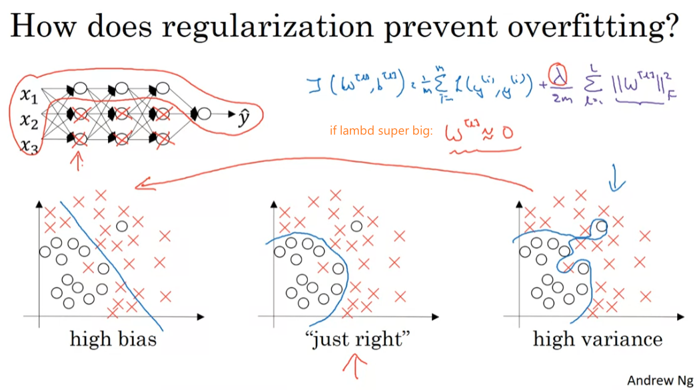


### Optimize NN training

1. normalize input -> fast training
2. vanishing/exploing gradiants: when you're training a very deep network your derivatives or your slopes can sometimes get either very, very big or very, very small, maybe even exponentially small, and this makes training difficult -> weight initialization + numerical approx of gradients
5. gradient checking (grad check)
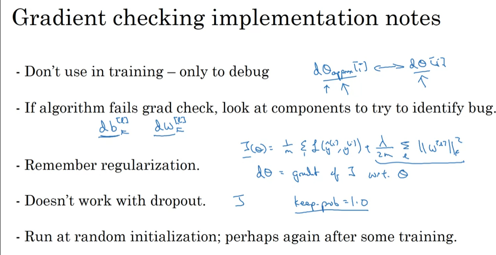

---
**XHU-Note:**

- **Regularization:**
  - Smaller weight values and spread-out weight distribution help reduce variance/overfitting.
  - L2 regularization: It consists of appropriately modifying your cost function,
  
  From: $$J = -\frac{1}{m} \sum\limits_{i = 1}^{m} \left( y^{(i)}\log\left(a^{[L](i)}\right) + (1-y^{(i)})\log\left(1- a^{[L](i)}\right) \right) \tag{1}$$

  To: $$J_{regularized} = -\frac{1}{m} \sum\limits_{i = 1}^{m} \left( y^{(i)}\log\left(a^{[L](i)}\right) + (1-y^{(i)})\log\left(1- a^{[L](i)}\right) \right) + \frac{1}{m} \frac{\lambda}{2} \sum\limits_l\sum\limits_k\sum\limits_j W_{k,j}^{[l]2} \tag{2}$$

  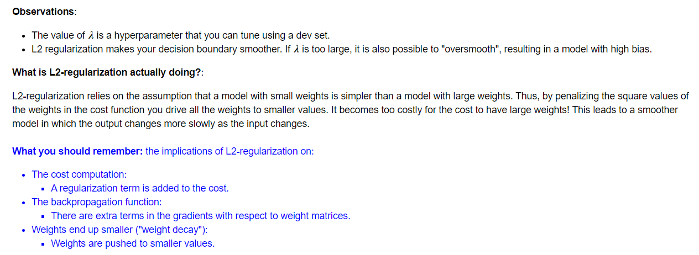

- **Reduce Bias:**
  - Deeper/bigger neural networks can help reduce bias.

- **Dropout Usage:**
  - Use dropout only when necessary, it'll bring bigger error
  - only use dropout during training. Don't use dropout (randomly eliminate nodes) during test time.

- **$W^{[l]}$ Initialization**
  - Xavier initialization: `sqrt(1./layers_dims[l-1])`
  - He initialization:`sqrt(2./layers_dims[l-1])`. this is named for the first author of He et al., 2015.
  - 

## C2W2 Optimize Algorithms

- Mini batch

- Exponentially Weighted Averages / gradient descent momentum
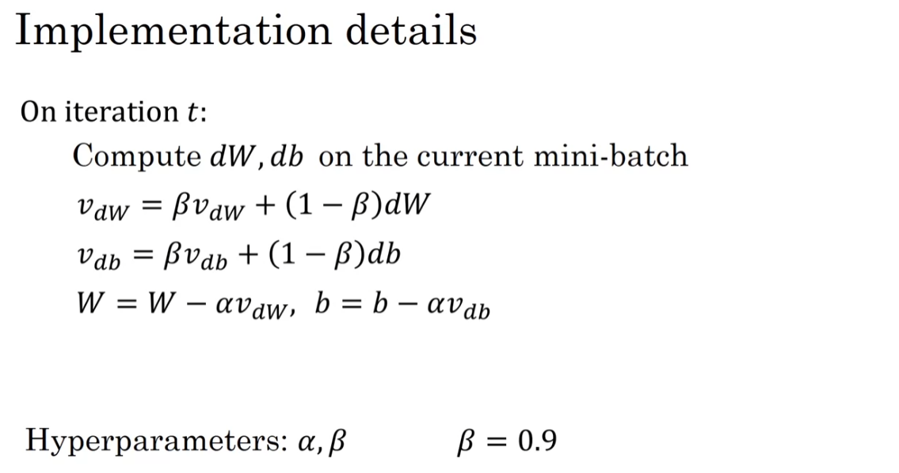
- RMSProp

- Adam (Adapt moment estimation) algorithm: combine above
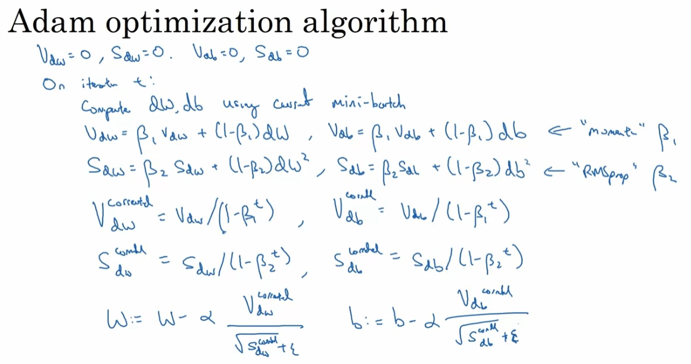

---
**XHU-Note:**

- **Mini batch**
  - Shuffling and Partitioning are the two steps required to build mini-batches
  - Powers of two are often chosen to be the mini-batch size, e.g., 16, 32, 64, 128.
- **Momentum**
  - The momentum update rule is, for $l = 1, ..., L$
    $$ \begin{cases}
    v_{dW^{[l]}} = \beta v_{dW^{[l]}} + (1 - \beta) dW^{[l]} \\
    W^{[l]} = W^{[l]} - \alpha v_{dW^{[l]}}
    \end{cases}$$
    $$\begin{cases}v_{db^{[l]}} = \beta v_{db^{[l]}} + (1 - \beta) db^{[l]} \\
    b^{[l]} = b^{[l]} - \alpha v_{db^{[l]}}
    \end{cases}$$

- **Adam**
  - It calculates an exponentially weighted average of past gradients, and stores it in variables $v$ (before bias correction) and $v^{corrected}$ (with bias correction).
  - It calculates an exponentially weighted average of the squares of the past gradients, and  stores it in variables $s$ (before bias correction) and $s^{corrected}$ (with bias correction).
  - It updates parameters in a direction based on combining information from "1" and "2".

  - The update rule is, for $l = 1, ..., L$:
    $$\begin{cases}
    v_{dW^{[l]}} = \beta_1 v_{dW^{[l]}} + (1 - \beta_1) \frac{\partial \mathcal{J} }{ \partial W^{[l]} } \\
    v^{corrected}_{dW^{[l]}} = \frac{v_{dW^{[l]}}}{1 - (\beta_1)^t} \\
    s_{dW^{[l]}} = \beta_2 s_{dW^{[l]}} + (1 - \beta_2) (\frac{\partial \mathcal{J} }{\partial W^{[l]} })^2 \\
    s^{corrected}_{dW^{[l]}} = \frac{s_{dW^{[l]}}}{1 - (\beta_2)^t} \\
    W^{[l]} = W^{[l]} - \alpha \frac{v^{corrected}_{dW^{[l]}}}{\sqrt{s^{corrected}_{dW^{[l]}}} + \varepsilon}
    \end{cases}$$
    where:
    - t counts the number of steps taken of Adam
    - L is the number of layers
    - $\beta_1$ and $\beta_2$ are hyperparameters that control the two exponentially weighted averages.
    - $\alpha$ is the learning rate
    - $\varepsilon$ is a very small number to avoid dividing by zero

## C2W3

Hyperparameters Tuning：(systematically)

- add randomness

- coarse to fine


---

# **C3 - Structing ML project**

## C3W1


**distinguish steps, seperating issues**

Human-level error <-> train error <-> dev error
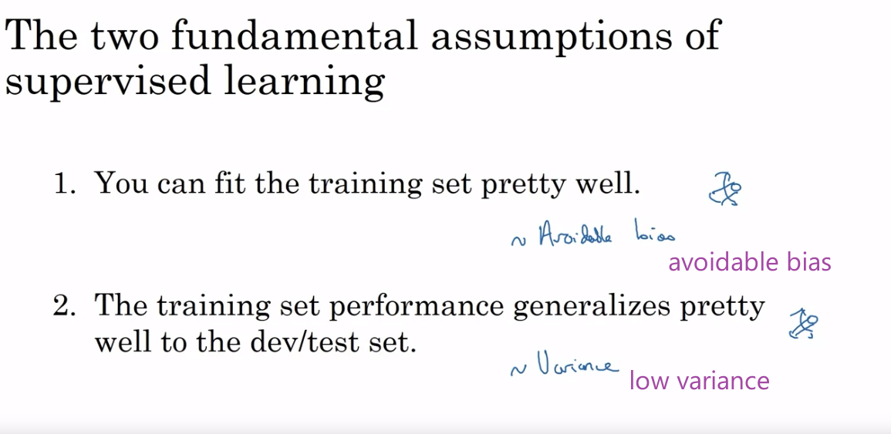


## C3W2

- Train/Dev/Test set mismatch issue
- Transfer learning & Multitask learning
- end-to-end deep learning

# **C4 - Convolusional Nerual Network**

## C4W1 Fundation of ConV NN

- edge detection
- padding (p) and stribe (s)
- Conv Layer > Pooling Layer > Dense (Fully connected) Layer

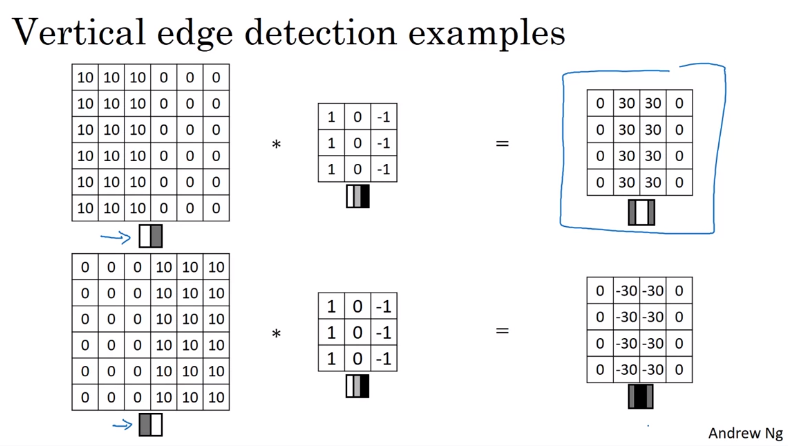


numpy.pad

```
a = [[[1, 2], [3, 4]],[[5,7],[7,8]]]
np.pad(a, ((0,0),(1,1),(2,2)), 'constant', constant_values=(0, 0))

array([[[0, 0, 0, 0, 0, 0],
        [0, 0, 1, 2, 0, 0],
        [0, 0, 3, 4, 0, 0],
        [0, 0, 0, 0, 0, 0]],

       [[0, 0, 0, 0, 0, 0],
        [0, 0, 5, 7, 0, 0],
        [0, 0, 7, 8, 0, 0],
        [0, 0, 0, 0, 0, 0]]])
```

The formulas relating the output shape of the convolution to the input shape are:

$$n_H = \Bigl\lfloor \frac{n_{H_{prev}} - f + 2 \times pad}{stride} \Bigr\rfloor +1$$
$$n_W = \Bigl\lfloor \frac{n_{W_{prev}} - f + 2 \times pad}{stride} \Bigr\rfloor +1$$
$$n_C = \text{number of filters used in the convolution}$$

## C4W2

DeepLearning classic convolution model


Residual Network


Mobile Net


## C4W3 Object Detection


Segmentation with U-net

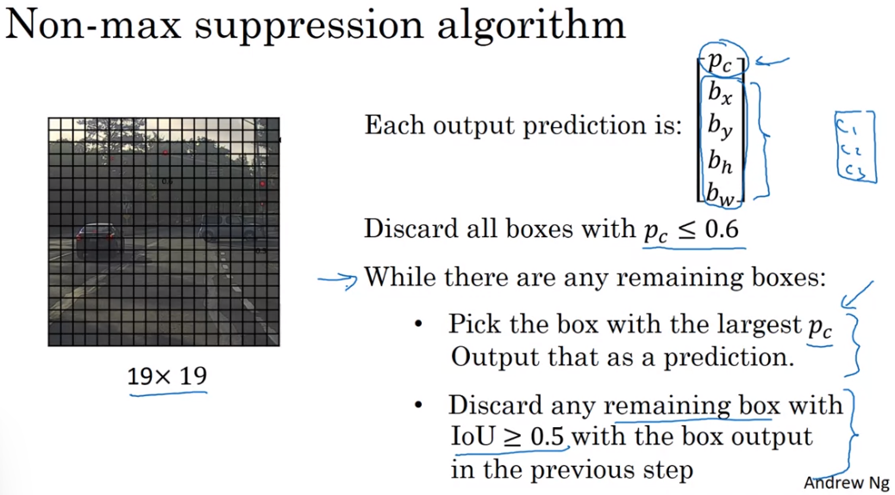

## C4W4 Case Study

### Face Recognition

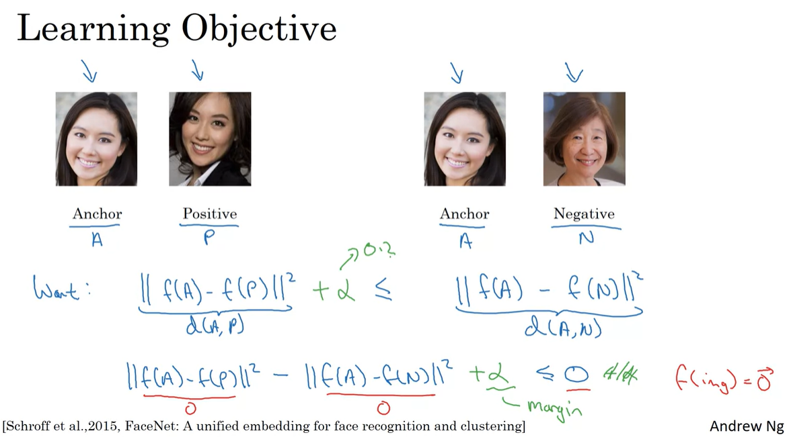

**triplet_loss:**
Implement the triplet loss as defined by formula (3). These are the 4 steps:

1. Compute the distance between the encodings of "anchor" and "positive": $\mid \mid f(A^{(i)}) - f(P^{(i)}) \mid \mid_2^2$
2. Compute the distance between the encodings of "anchor" and "negative": $\mid \mid f(A^{(i)}) - f(N^{(i)}) \mid \mid_2^2$
3. Compute the formula per training example: $ \mid \mid f(A^{(i)}) - f(P^{(i)}) \mid \mid_2^2 - \mid \mid f(A^{(i)}) - f(N^{(i)}) \mid \mid_2^2 + \alpha$
4. Compute the full formula by taking the max with zero and summing over the training examples:$$\mathcal{J} = \sum^{m}_{i=1} \large[ \small \mid \mid f(A^{(i)}) - f(P^{(i)}) \mid \mid_2^2 - \mid \mid f(A^{(i)}) - f(N^{(i)}) \mid \mid_2^2+ \alpha \large ] \small_+ \tag{3}$$

---

### Netural Style Transfer

$$J(G) = \alpha J_{content}(C,G) + \beta J_{style}(S,G)$$
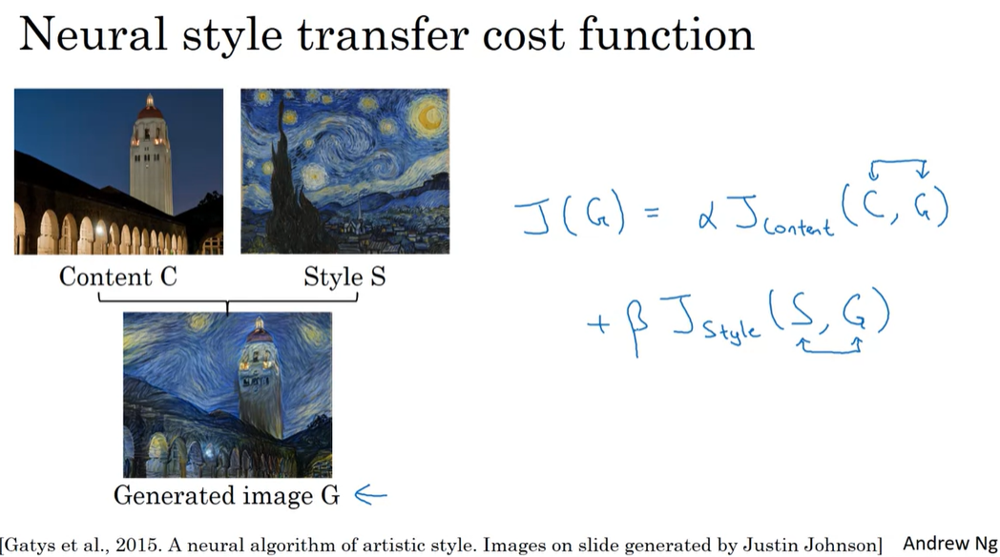

$$J_{content}(C,G) =  \frac{1}{4 \times n_H \times n_W \times n_C}\sum _{ \text{all entries}} (a^{(C)} - a^{(G)})^2\tag{1} $$


$$J_{style}^{[l]}(S,G) = \frac{1}{4 \times {n_C}^2 \times (n_H \times n_W)^2} \sum _{i=1}^{n_C}\sum_{j=1}^{n_C}(G^{(S)}_{(gram)i,j} - G^{(G)}_{(gram)i,j})^2\tag{2} $$

- $G_{gram}^{(S)}$ Gram matrix of the "style" image.
- $G_{gram}^{(G)}$ Gram matrix of the "generated" image.
- Make sure you remember that this cost is computed using the hidden layer activations for a particular hidden layer in the network $a^{[l]}$


### Reference Paper


# **C5 - Sequential Model**

## C5W1 RNN


### Gated Recurrent Unit (GRU)

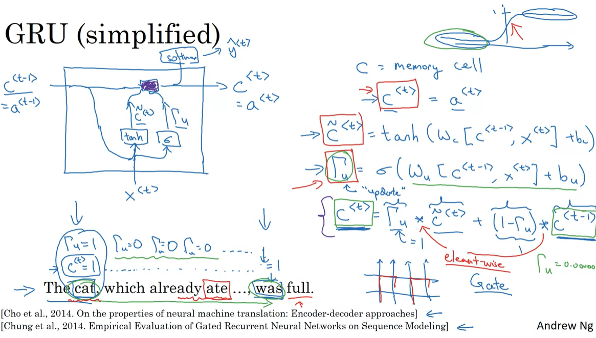

### Overview of gates and states

#### Forget gate $\mathbf{\Gamma}_{f}$

- Let's assume you are reading words in a piece of text, and plan to use an LSTM to keep track of grammatical structures, such as whether the subject is singular ("puppy") or plural ("puppies").
- If the subject changes its state (from a singular word to a plural word), the memory of the previous state becomes outdated, so you'll "forget" that outdated state.
- The "forget gate" is a tensor containing values between 0 and 1.
  - If a unit in the forget gate has a value close to 0, the LSTM will "forget" the stored state in the corresponding unit of the previous cell state.
  - If a unit in the forget gate has a value close to 1, the LSTM will mostly remember the corresponding value in the stored state.

##### Equation

$$\mathbf{\Gamma}_f^{\langle t \rangle} = \sigma(\mathbf{W}_f[\mathbf{a}^{\langle t-1 \rangle}, \mathbf{x}^{\langle t \rangle}] + \mathbf{b}_f)\tag{1} $$

##### Explanation of the equation

- $\mathbf{W_{f}}$ contains weights that govern the forget gate's behavior.
- The previous time step's hidden state $[a^{\langle t-1 \rangle}$ and current time step's input $x^{\langle t \rangle}]$ are concatenated together and multiplied by $\mathbf{W_{f}}$.
- A sigmoid function is used to make each of the gate tensor's values $\mathbf{\Gamma}_f^{\langle t \rangle}$ range from 0 to 1.
- The forget gate  $\mathbf{\Gamma}_f^{\langle t \rangle}$ has the same dimensions as the previous cell state $c^{\langle t-1 \rangle}$.
- This means that the two can be multiplied together, element-wise.
- Multiplying the tensors $\mathbf{\Gamma}_f^{\langle t \rangle} * \mathbf{c}^{\langle t-1 \rangle}$ is like applying a mask over the previous cell state.
- If a single value in $\mathbf{\Gamma}_f^{\langle t \rangle}$ is 0 or close to 0, then the product is close to 0.
  - This keeps the information stored in the corresponding unit in $\mathbf{c}^{\langle t-1 \rangle}$ from being remembered for the next time step.
- Similarly, if one value is close to 1, the product is close to the original value in the previous cell state.
  - The LSTM will keep the information from the corresponding unit of $\mathbf{c}^{\langle t-1 \rangle}$, to be used in the next time step.

#### Update gate $\mathbf{\Gamma}_{i}$

- You use the update gate to decide what aspects of the candidate $\tilde{\mathbf{c}}^{\langle t \rangle}$ to add to the cell state $c^{\langle t \rangle}$.
- The update gate decides what parts of a "candidate" tensor $\tilde{\mathbf{c}}^{\langle t \rangle}$ are passed onto the cell state $\mathbf{c}^{\langle t \rangle}$.
- The update gate is a tensor containing values between 0 and 1.
  - When a unit in the update gate is close to 1, it allows the value of the candidate $\tilde{\mathbf{c}}^{\langle t \rangle}$ to be passed onto the hidden state $\mathbf{c}^{\langle t \rangle}$
  - When a unit in the update gate is close to 0, it prevents the corresponding value in the candidate from being passed onto the hidden state.
- Notice that the subscript "i" is used and not "u", to follow the convention used in the literature.

##### Equation

$$\mathbf{\Gamma}_i^{\langle t \rangle} = \sigma(\mathbf{W}_i[a^{\langle t-1 \rangle}, \mathbf{x}^{\langle t \rangle}] + \mathbf{b}_i)\tag{2} $$

##### Explanation of the equation

- Similar to the forget gate, here $\mathbf{\Gamma}_i^{\langle t \rangle}$, the sigmoid produces values between 0 and 1.
- The update gate is multiplied element-wise with the candidate, and this product ($\mathbf{\Gamma}_{i}^{\langle t \rangle} * \tilde{c}^{\langle t \rangle}$) is used in determining the cell state $\mathbf{c}^{\langle t \rangle}$.

#### Output gate $\mathbf{\Gamma}_{o}$

- The output gate decides what gets sent as the prediction (output) of the time step.
- The output gate is like the other gates, in that it contains values that range from 0 to 1.

##### Equation

$$ \mathbf{\Gamma}_o^{\langle t \rangle}=  \sigma(\mathbf{W}_o[\mathbf{a}^{\langle t-1 \rangle}, \mathbf{x}^{\langle t \rangle}] + \mathbf{b}_{o})\tag{5}$$

##### Explanation of the equation

- The output gate is determined by the previous hidden state $\mathbf{a}^{\langle t-1 \rangle}$ and the current input $\mathbf{x}^{\langle t \rangle}$

- The sigmoid makes the gate range from 0 to 1.

---

### Long Short Term Memoty (LSTM)

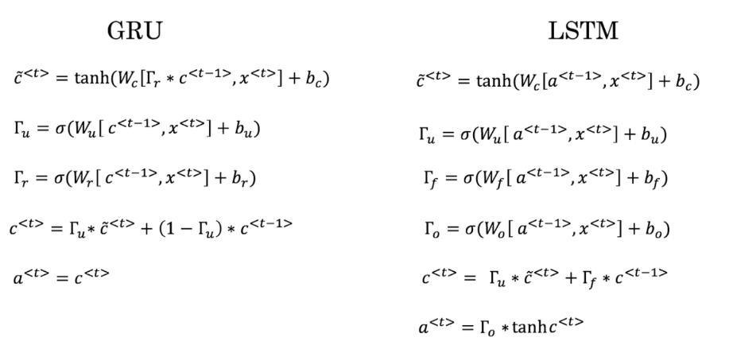


## C5W2 Natural Languange Process & Word Embedding

feature representation : word embedding


### Sentiment classification


### Debiasing Word Embedding

The derivation of the linear algebra to do this is a bit more complex. (See Bolukbasi et al., 2016 in the References for details.) Here are the key equations:


$$ \mu = \frac {e_{w1} + e_{w2}}{2}\tag{4}$$

$$ \mu_{B} = \frac {\mu \cdot \text{bias\_axis}}{||\text{bias\_axis}||_2^2} *\text{bias\_axis} \tag{5}$$

$$\mu_{\perp} = \mu - \mu_{B} \tag{6}$$

$$ e_{w1B} = \frac {e_{w1} \cdot \text{bias\_axis}}{||\text{bias\_axis}||_2^2} *\text{bias\_axis}
\tag{7}$$
$$ e_{w2B} = \frac {e_{w2} \cdot \text{bias\_axis}}{||\text{bias\_axis}||_2^2} *\text{bias\_axis}
\tag{8}$$

$$e_{w1B}^{corrected} = \sqrt{{1 - ||\mu_{\perp} ||^2_2}} * \frac{e_{\text{w1B}} - \mu_B} {||e_{w1B} - \mu_B||_2} \tag{9}$$

$$e_{w2B}^{corrected} = \sqrt{{1 - ||\mu_{\perp} ||^2_2}} * \frac{e_{\text{w2B}} - \mu_B} {||e_{w2B} - \mu_B||_2} \tag{10}$$

$$e_1 = e_{w1B}^{corrected} + \mu_{\perp} \tag{11}$$
$$e_2 = e_{w2B}^{corrected} + \mu_{\perp} \tag{12}$$

## C5W3 Sequence Model & Attention Mechanism
### Beam Search

### Bleu Score (Bilingual Evaluation)
### Attention Model

#### Pre-attention and Post-attention LSTMs on both sides of the attention mechanism
- There are two separate LSTMs in this model (see diagram on the left): pre-attention and post-attention LSTMs.
- *Pre-attention* Bi-LSTM is the one at the bottom of the picture is a Bi-directional LSTM and comes *before* the attention mechanism.
    - The attention mechanism is shown in the middle of the left-hand diagram.
    - The pre-attention Bi-LSTM goes through $T_x$ time steps
- *Post-attention* LSTM: at the top of the diagram comes *after* the attention mechanism.
    - The post-attention LSTM goes through $T_y$ time steps.

- The post-attention LSTM passes the hidden state $s^{\langle t \rangle}$ and cell state $c^{\langle t \rangle}$ from one time step to the next.

#### An LSTM has both a hidden state and cell state
- In the lecture videos, we were using only a basic RNN for the post-attention sequence model
    - This means that the state captured by the RNN was outputting only the hidden state $s^{\langle t\rangle}$.
- In this assignment, we are using an LSTM instead of a basic RNN.
    - So the LSTM has both the hidden state $s^{\langle t\rangle}$ and the cell state $c^{\langle t\rangle}$.

#### Each time step does not use predictions from the previous time step
- Unlike previous text generation examples earlier in the course, in this model, the post-attention LSTM at time $t$ does not take the previous time step's prediction $y^{\langle t-1 \rangle}$ as input.
- The post-attention LSTM at time 't' only takes the hidden state $s^{\langle t\rangle}$ and cell state $c^{\langle t\rangle}$ as input.
- We have designed the model this way because unlike language generation (where adjacent characters are highly correlated) there isn't as strong a dependency between the previous character and the next character in a YYYY-MM-DD date.

#### Concatenation of hidden states from the forward and backward pre-attention LSTMs
- $\overrightarrow{a}^{\langle t \rangle}$: hidden state of the forward-direction, pre-attention LSTM.
- $\overleftarrow{a}^{\langle t \rangle}$: hidden state of the backward-direction, pre-attention LSTM.
- $a^{\langle t \rangle} = [\overrightarrow{a}^{\langle t \rangle}, \overleftarrow{a}^{\langle t \rangle}]$: the concatenation of the activations of both the forward-direction $\overrightarrow{a}^{\langle t \rangle}$ and backward-directions $\overleftarrow{a}^{\langle t \rangle}$ of the pre-attention Bi-LSTM.

#### Computing "energies" $e^{\langle t, t' \rangle}$ as a function of $s^{\langle t-1 \rangle}$ and $a^{\langle t' \rangle}$
- Recall in the lesson videos "Attention Model", at time 6:45 to 8:16, the definition of "e" as a function of $s^{\langle t-1 \rangle}$ and $a^{\langle t \rangle}$.
    - "e" is called the "energies" variable.
    - $s^{\langle t-1 \rangle}$ is the hidden state of the post-attention LSTM
    - $a^{\langle t' \rangle}$ is the hidden state of the pre-attention LSTM.
    - $s^{\langle t-1 \rangle}$ and $a^{\langle t \rangle}$ are fed into a simple neural network, which learns the function to output $e^{\langle t, t' \rangle}$.
    - $e^{\langle t, t' \rangle}$ is then used when computing the attention $\alpha^{\langle t, t' \rangle}$ that $y^{\langle t \rangle}$ should pay to $a^{\langle t' \rangle}$.

- The diagram on the right of figure 1 uses a `RepeatVector` node to copy $s^{\langle t-1 \rangle}$'s value $T_x$ times.
- Then it uses `Concatenation` to concatenate $s^{\langle t-1 \rangle}$ and $a^{\langle t \rangle}$.
- The concatenation of $s^{\langle t-1 \rangle}$ and $a^{\langle t \rangle}$ is fed into a "Dense" layer, which computes $e^{\langle t, t' \rangle}$.
- $e^{\langle t, t' \rangle}$ is then passed through a softmax to compute $\alpha^{\langle t, t' \rangle}$.
- Note that the diagram doesn't explicitly show variable $e^{\langle t, t' \rangle}$, but $e^{\langle t, t' \rangle}$ is above the Dense layer and below the Softmax layer in the diagram in the right half of figure 1.
- We'll explain how to use `RepeatVector` and `Concatenation` in Keras below.

#### Implementation Details

Let's implement this neural translator. You will start by implementing two functions: `one_step_attention()` and `model()`.

#### one_step_attention
- The inputs to the one_step_attention at time step $t$ are:
    - $[a^{<1>},a^{<2>}, ..., a^{<T_x>}]$: all hidden states of the pre-attention Bi-LSTM.
    - $s^{<t-1>}$: the previous hidden state of the post-attention LSTM
- one_step_attention computes:
    - $[\alpha^{<t,1>},\alpha^{<t,2>}, ..., \alpha^{<t,T_x>}]$: the attention weights
    - $context^{ \langle t \rangle }$: the context vector:

$$context^{<t>} = \sum_{t' = 1}^{T_x} \alpha^{<t,t'>}a^{<t'>}\tag{1}$$

##### Clarifying 'context' and 'c'
- In the lecture videos, the context was denoted $c^{\langle t \rangle}$
- In the assignment, we are calling the context $context^{\langle t \rangle}$.
    - This is to avoid confusion with the post-attention LSTM's internal memory cell variable, which is also denoted $c^{\langle t \rangle}$.

### CTC Model

**xhu_Note**
The encoder-decoder model works quite well with short sentences. The true advantage for the attention model occurs when the input sentence is large.

## C5W4 Self-Attention
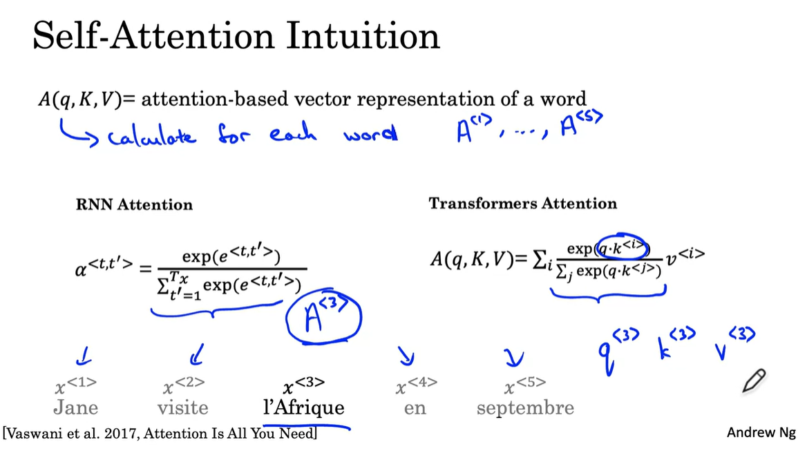

The use of self-attention paired with traditional convolutional networks allows for parallelization which speeds up training. You will implement **scaled dot product attention** which takes in a query, key, value, and a mask as inputs to return rich, attention-based vector representations of the words in your sequence. This type of self-attention can be mathematically expressed as:
$$
\text { Attention }(Q, K, V)=\operatorname{softmax}\left(\frac{Q K^{T}}{\sqrt{d_{k}}}+{M}\right) V\tag{4}\
$$

- $Q$ is the matrix of queries
- $K$ is the matrix of keys
- $V$ is the matrix of values
- $M$ is the optional mask you choose to apply
- ${d_k}$ is the dimension of the keys, which is used to scale everything down so the softmax doesn't explode

### Sine and Cosine Positional Encodings

Now you can use the angles you computed to calculate the sine and cosine positional encodings.
$$
PE_{(pos, 2i)}= sin\left(\frac{pos}{{10000}^{\frac{2i}{d}}}\right)
$$
<br>
$$
PE_{(pos, 2i+1)}= cos\left(\frac{pos}{{10000}^{\frac{2i}{d}}}\right)
$$

### MultiHead Attention
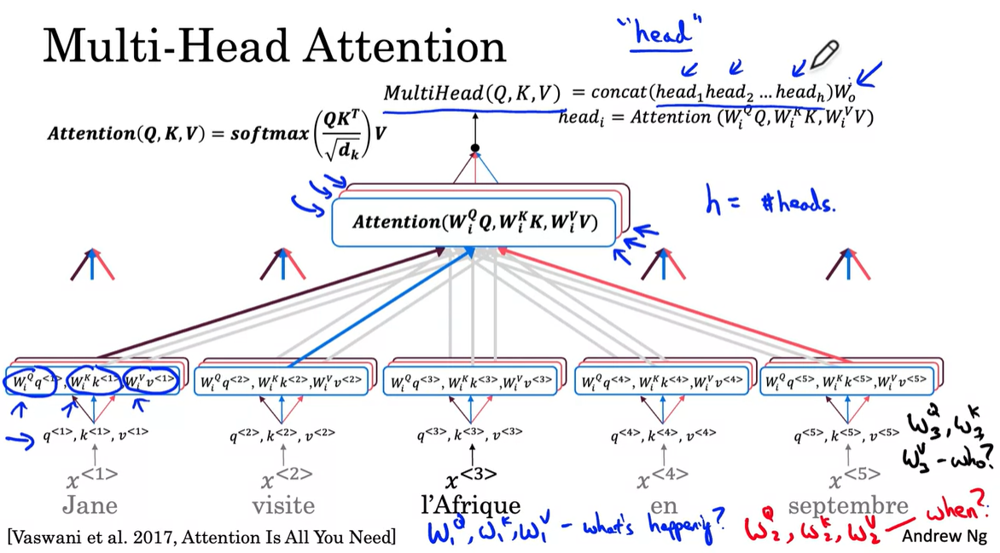

