* Identify the key components of the ML Lifecycle.
* Define “concept drift” as it relates to ML projects.
* Differentiate between shadow, canary, and blue-green deployment scenarios in the context of varying degrees of automation.
* Compare and contrast the ML modeling iterative cycle with the cycle for deployment of ML products.
* List the typical metrics you might track to monitor concept drift.

# Course Scope

* C1 Introduction to Machine Learning in Production
* C2 Machine Learning Data Lifesycle in Production
* C3 Machine Learning Modeling Pipelines in Production
* C4 Deploying Machine Learning Models in Production

# C1 Introduction to Machine Learning in Production

## Blueprint

machine learning project modules


machine learning project lifecycle


Three parts are equally important: Code + Hyperparamters + Data >> ML Model

MLOps(Machine Learning Operations): an emerging discipline, and comprises a set of tools and principles to support progress throughthe ML project lifecycle. **Systematic way of thinking**

Stages: Scoping >> Data >> Modeling >> Deployment
Iterative: First deployment v.s. Maintainence

## 1. Scoping

### Scoping process

* Brainstorm business problems(not AI problem)
  * What are the top 3 things you wish were working better?
* Brainstorm AI solutions
* Assess the feasibility (dilligence): is it technically feasible?
  * Use external benchmark to evaluate(literature, other company, competitor)
  
  * Do we have features that are predictive?
  * The history of the project
  * Dilligence on value (Fermi estimates)
  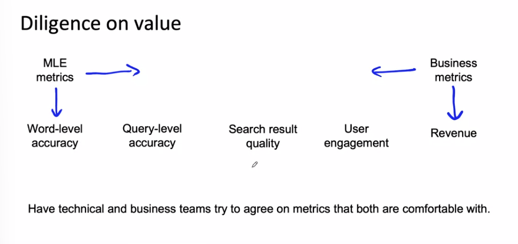
* Assess potential solutions
* Determinate milestones
  * Key specifications:
    * ML metrics (accuracy, presicion/recall, etc)
    * Software matrics(latency, throughput,etc.given compute resources)
    * Business metrcs(revenue, etc)
* Budget for resources
  * Resources needed(data, personnel, help from other teams)
  * Timeline

**xhu_Note**:

1. Separating problem identification from solution and use each 'method' to solve eacn 'problem' (learned from marker_cleanup_post too)
2. What to achieve > How to achieve
3. Two dimension coordination system is quite useful to help sorting

## 2. Data

### Define Data and Establish Baseline

Data defination: input X and target label Y

* Major type of data problems
  
  * Unstructured adata:
    * May or may not have huge collection of unalbeled exmpales x.
    * Human can label more data
    * Data agumentation more likely to be helpful
  * Structured data:
    * May be more difficult to obtain more data
    * Human labeling may not be possible
  * Small data:
    * Clean labels are critical
    
    * Can manually lookthrough dataset and fix labels
    * Can get all the labelers to talk to each others
  * Big Data:
    * Emphasis data process
    * (Big data sometimes have long tail of rare events in the input where clean labels are critical too < small data problem >)

**xhu note:** different Eng/Proj experiences might only map to one quadrant of above cordination system. (FT ?-> Structured + Big Data)

### Label and organize data

* Improving label consistancy
  * Have multiple labelers label same example
  * Where there is disagree,emt, have MLE, subhect matter export (SME)and /or labeler discuss defination of y to reach
  * If labelers believe that x does NOT contrain enough information, consider changing x
  * Iterate until it is hard to significate improve the data
  * Have a class/label to capture uncertainty: 0 , borderline, 1
  * 

* Human level performance (HLP)
  * Why HLP? Estimate Bayes error / irreducible error to help with error analysis and prioritiaztion
  

### Obtaining data

* Get into iteration loop as quickly as possible (Unless you have worked on the problem before and have sense of how much data it is need)
* Ask: How much data can we obtain in k days?
* Brainstorm list of data sources:
  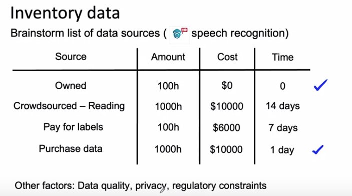
* Labeling data
  * Options: In-house v.s. outsourced v.s. crowdssourced
  * Don't increase data by more than 10x at a time
  * Label data yourself for a while to get the 'sense'

### Data pipeline (in iteration)

* Make sure the scripts/data is replicable
* POC (proof-of-concept) > Production phases:
  * 
* Balanced train/dev/test splits
  * distribute 3 set equally in small data problems
  * random split will be representative
* Example: **keep track of data provenace and lineage** (using meta data is one of the methods)
    

## 3. Modeling

AI system = Code (algorithm/model) + Data
Model-centic AI development v.s. Data-centric AI development

### Key changllenges

* Model development is an iterative process
  * 
* Challenges in model development
  * Do well in : training set > dev/test set > business metric/project goals
  * Why low avg error isn't good enough: single std can not reflact on key slices
* Rare classes
  * Skewed data distribution
  * Accuracy in rare classes

### Selecting and training model

* Establish a baseline
  * Establish a baseline level of performace
  * Unstructured and structured data: human good at unstructured v.s. machine good at structured
  * 
* Tips for getting started
  * Starting on modeling
    * literacture search to see what's possible (courses, blogs, open-source projects)
    * Find open-source implementations if avaiblable
    * A reasonable algorithm with good data will often outperform a great algorithm with no so good data > lastest != greatest
  * Sanity-check for code and algorithm
    * overfit a small training dataset before the large one

### Error analysis

* Use tags can help catergoize issue
    
* Prioritizing what to work on
  * How much room for improvement there is
  * How frequently that category appears
  * How easy is to improve accuracy in that catergory
  * How important it is to improve in that catergory
* Adding/improving data for specific categories (for target catego)
  * Collect more data
  * Use data aguementation to get more data
  * Importve label accuracy / data quality

Example Analysis

Skewed dataset : large portion of data is '0'
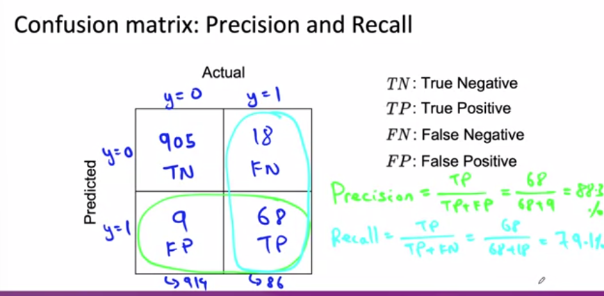


### Performace auditing

Auditing framework

* Check for accuracy, fiarness/bias, and other probelms
  * Brainstore what might go wrong
  * Establish metrics

### Data iteration Loop (during iteration of model)

**Model-centric view:** Take the data you have and develop a model that does as well as possible > Hold the data fixed and iteratively improve the code/mode
**Data-centric view:** The quality of the data is paramount. Use tools to improve the data quality; this will allow multiple models to do well > Hold the code fixed and iteratively improve the data

Example of data augmentation analysis
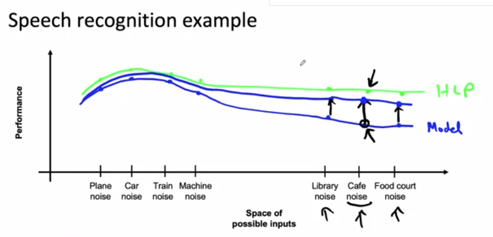

* Data augmentaiton
  * Goal: Create 'realistic' examples that algotiythm does poorly on but humans (or other baseline) can do well on
* Data iteration
  * 
  * for unstructure data: If the model is sufficiently large (less bias), adding data will not hurts accuracy
  * for structure data: Adding features. (collebrative filter v.s. content filter aka cold-start filter)
* Experiment tracking (systematic)
  * 


## 4. Deployment

### Key challenges

* Concept drift & Data drift
  * Concept drift: X-> Y mapping drift
  * Data drift: training set/test set etc. gradual change / sudden shock
* Software engineering issues
  * Realtime or Batch
  * Cloud vs. Edge/Browser
  * Coupute resources (CPU/GPU/memory)
  * Latency, thoughput(QPS: query per seconds - e.g. 500ms)
  * Security and privacy

### Deployment patterns

* Common deployment cases:
  * New oriduct/capaibility
  * Automate/assist with manual task
  * Replace previous ML system

* Common deployment methods:
  * Canary deployment : Gradual ramp up with monitoring or Rollback
  * Blue green deployment: Switch to new model directly but can swtich back
  * Degree of automation:
  Human only >> Shadow mode >> AI assistance >> Partial automation >> Full automation


### Monitoring + Maintainance


Ref:

* <https://papers.nips.cc/paper/2015/file/86df7dcfd896fcaf2674f757a2463eba-Paper.pdf>
* <http://arxiv.org/abs/2011.09926>
* <http://arxiv.org/abs/2010.02013>

## C2 Machine Learning Engineering for Production (MLOps) Specialization


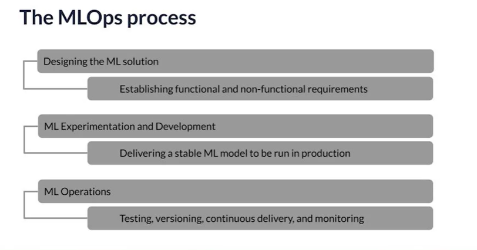

## C2W1 Collecting,Labeling and Validating Data

* Production ML = ML development + software development
  
  
* Managing the entire life cycle of data
  * Labeling
  * Feature space coverage
  * Minimal dimensionality
  * Maximum predictive data
  * Fairness
  * Rare conditions
* Modern software development (Criterias)
  * Scalability
  * Extensibility
  * Configuration
  * Consistency & reproducibility
  * Safety & security
  * Modularity
  * Testability
  * Monitoring
* Challenges in production grade ML
  * Build itergrated ML system
  * Continuous operate it in production
  * Handle continuously changing data
  * Optimize compute resource costs

### ML Pipelines


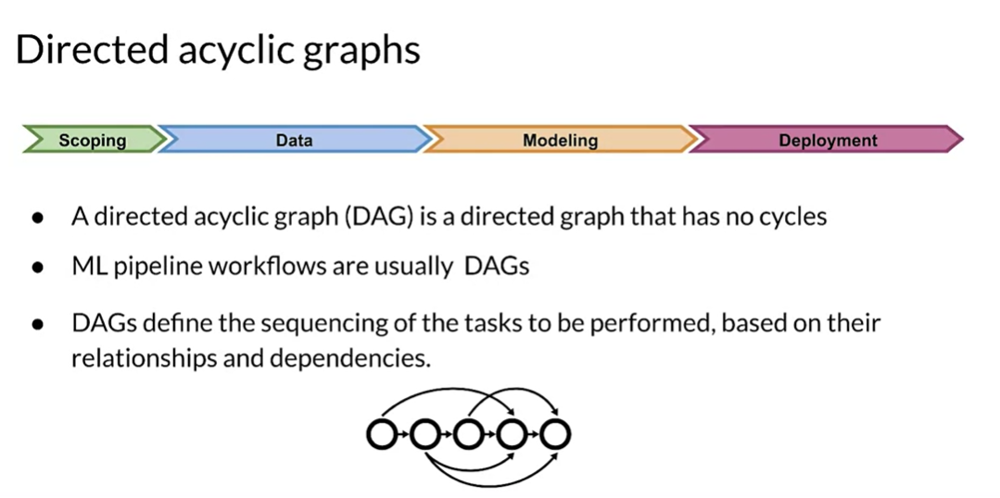


### Collecting Data

data collect > ingest > prepare

* Importance of data quality
* Data pipeline: data collection, ingestion and preparation
* Data collection and monitoring


Key points:
  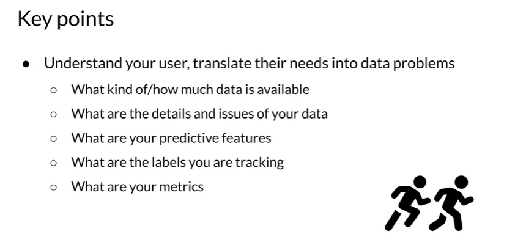
  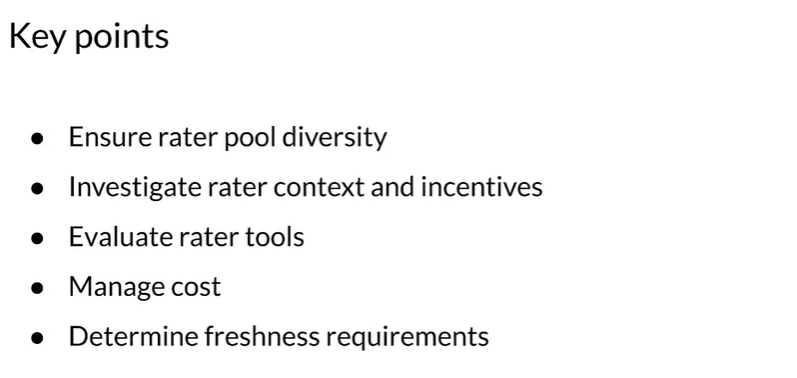

**xhu NOTE**

* Representational harms include perpetuating harmful stereotypes about or minimizing the existence of a social group, such as a racial, ethnic, gender, or religious group. Machine learning algorithms often commit representational harm when they learn patterns from data that have algorithmic bias.
* Rater categorise: generalist , experts & targer users

### Labeling Data

* Model performance decays over time, and model retraining helps improve or maintain performance.
* Data labeling is a key part of supervised learning and needs to be approached based on the specific problem and domain.


* Direct Labeling v.s. Derived Labeling (Human raters)

**xhu note**
Direct Labeling (aka Process Feedback) labels come from monitoring predictions, not from a "rater" as in this example. But what id we don't have data to log?:

* Use a heuristic for a first launch, then train a system based on logged data.
* Use logs from a similar problem to bootstrap your system.
* Use human raters to generate data by completing tasks.
* ref:<https://developers.google.com/machine-learning/data-prep/construct/collect/label-sources>

### Validating Data

#### Data Issues

* drift and skel
  * data and concept drift
  * schema skel
  * distribution skek

| Concept | Description |
|-------------|-------------|
| Drift       | Changes in data over time, such as data collected once a day |
| Skew        | Difference between two static versions or different sources, such as training set and serving set |


#### Detecting data issues

* detecing schema skew
  * Training and serving data do not conform to the same schema
* deteching distribution skew
  * dataset shift -> covariate or concept shift
  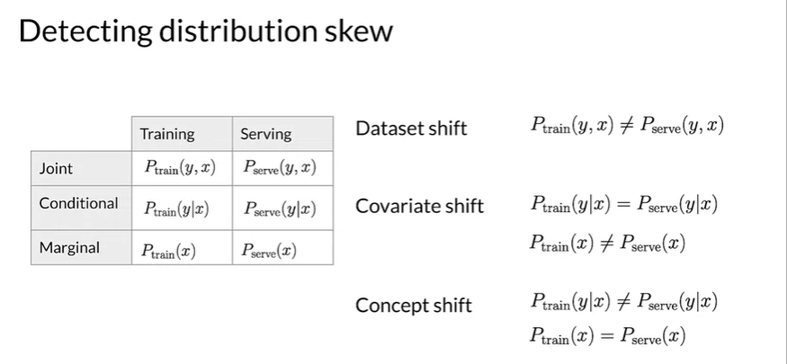

**data requires continuous evaluation**


TensorFlow Data Validation


<https://github.com/cdfoundation/sig-mlops/blob/main/roadmap/2022/MLOpsRoadmap2022.md>

## C2W2 Feature Engineering, Transformation and Seletion

### Feature Engineering

#### Introduction

* Squeezing the most out of data
  * Making data usefulbefore training a model
  * Representing data in forms that help models learn
  * Increasing predictive quality
  * Reducing dimentionalitywith feathre engineering
* The art of feature engineering
  * 
* How feature engineering is done ina typical ML pipeline
  * 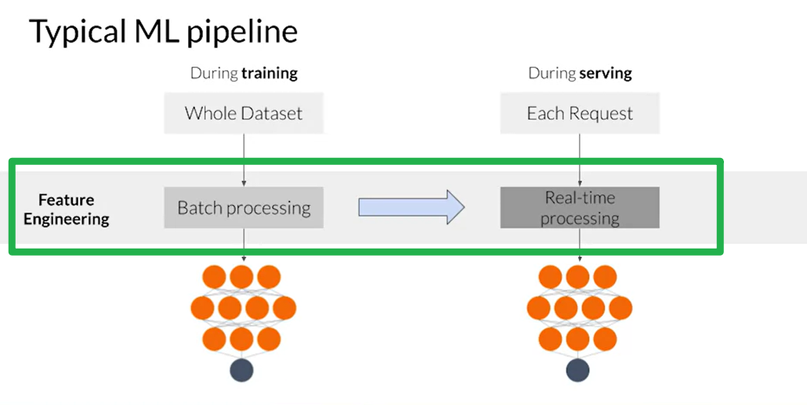
* Feature engineering process
  * 

#### Preprocessing Operations

* Main preprocessing operations
  * Data cleansing, Feature tuning, Representation transofmration, Feature extractation, Feature construction
* Mapping raw data into features (Vectorizel)
  * 
* Mapping numeric values
* Mapping catergorical values
  * 
* Empirical knowledge of data
  * Text  - stemming, lemmatization, TF-IDF embedding lookup
  * Imges- clipping, resizing, cropping, blur, Canny filters, Sober filters
  

#### Techniques

* Feature Scaling
  * Converts values from natural range into a prescribed range. e.g. (0,255) to (-1,1)
  * Benefits: coverge faster, lower NaN, model learns the right weights
* Normalization and Standardization
  * 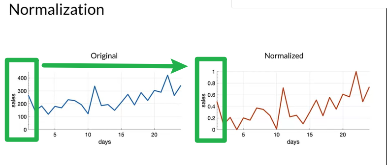
  * 
* Bucketizing / Binning
* Other techniques
  * Dimensionality reduction in embeddig
  * (TensorFlow embedding projector for high dimension data visualize)
  * Feature corsses: Combines multiple features together into a new feature(space)/encode same into in fewer features, e.g A, B -> A x B
  * Feature coding: transforming categorical to a continuous variables
  

### Feature Transform in scale


#### Preprocessing Data at Scale

  

* Inconsistancies in feature engineering (important)
  * traning & serving code paths are different
  * diverse delopments scenarios: mobile - TF lite, server - TF Serving, Web -TF JS
  * risk of introducing training-serving skew
  * skel will lower the performace of your serving model
* Preprocssing granularity
  * 
* Pre-procssing training dataset
    |                            | Pre-processing training dataset | Transforming within the model |
    |----------------------------|---------------------------------|-------------------------------|
    | Pros                       | - Run-once                       | - Easy iteration              |
    |                            | - Compute on the entire dataset | - Transformation guarantees   |
    | Cons                       | - Transformations reproduced at serving | - Slower iteration |
    |                            | - Ling model latency            | - Expensive transforms       |
    |                            | - Transformations per batch: skew |                               |
* Optimizing instance-level transformations
  * indirectly affect traning efficiency
  * typically accelerators sit idle while the CPUs transform
  * Solutions:
    * Prefetching transforms for better accelerator efficiency
* Sum of Challanegs
  * Balancing the predictive performace
  * Full-pass transformations on traning data
  * Optimizing instance0level transforations for better traning efficiency
  

#### TensorFlow Transform

* Benefits of using TensorFlow Transform
  
* Applied feature transformations
* tf.Transform Analyzers
  
  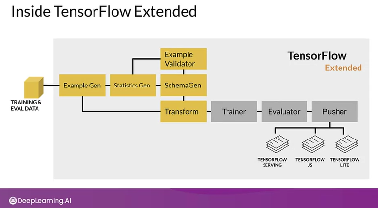
  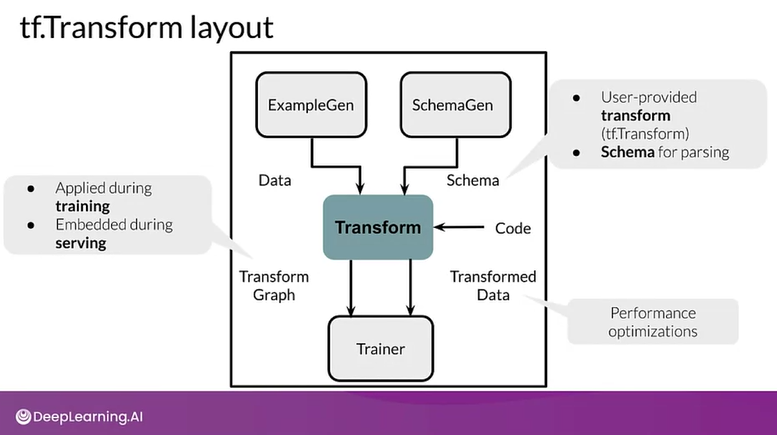
  
  
  

**xhu Note**

<https://www.tensorflow.org/tfx/guide/tft_bestpractices>

### Feature Selection

#### Feature Spaces

* Introductions to Feature Space
  * N dimesional space defined by N features
  * Not including the target label
      X = [x1, x2, x3, ..., xN]
  * Feature space coverage:
    * Same numerical ranges
    * Same classes
    * Similar characteristics for image data
    * Similar vocabulary, syntax and sematics for NLP data
  * 

#### Feature Selection

* Why?
  * identify featues that best represent the data
  * remove featues that don't influence the outcome
  * reduce the size of the feature space
  * resuce the resource requirements and model complexity (IO, storage, and inference costs)
* How?
  * Unsupervised
    * Feature-target variable relationship NOT considered
    * Remove redundant features(correlation)
  * Supervised
    * Feature-target variable relationship considered
    * Select features that are most relevant to the target variable

* Supervised Feature Selection Methods:
  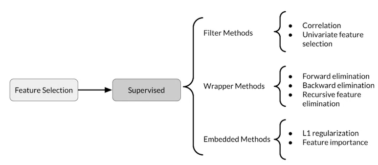
  
  * Filter Methods: e.g.Pearson correlation
      Filter methods suffer from inefficiencies as they need to look at all the possible feature subsets.
      
  * Wrapper Methods
      Wrapper methods are based  on the greedy algorithm and thus solutions are slow to compute.
      
  * Embedded Methods

**xhu Note**

<https://www.tensorflow.org/tfx/guide#tfx_pipelines>

## C2W3 Data Journey and Data Storage

### Data Journey

#### The data journy

* Raw features and labels
* Input-output map
* ML model to learn the map
  

#### Data provenace

  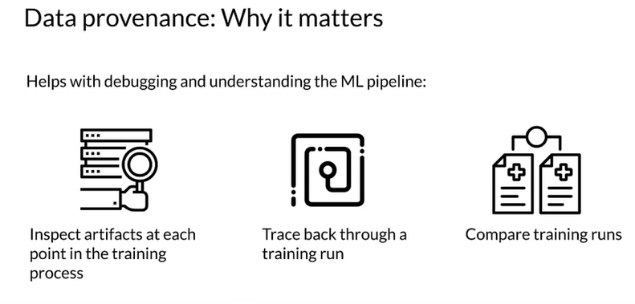

#### Data lineage

  

#### Data versioning

  

### ML metadata

Metadata: Tracking artifacts and pipeline changes (Using ML metadata to track changes)
Ordinary ML data pipeline

* Data Validation -> Data Transformation


|         Units                   | Types           | Relationships |
|----------------------------|-----------------|-----------------|
| Artifact                       | ArtifactType   | Event            |
| Execution                     | ExecutionType | Attribution   |
| Context                        | ContextType   | Association    |


#### ML Data

* Architecture and nomenclature
* Tracking metadata flowing between components in pipeline


```html
Data model ref: https://www.tensorflow.org/tfx/guide/mlmd#data_model

The Metadata Store uses the following data model to record and retrieve metadata from the storage backend.

* ArtifactType describes an artifact's type and its properties that are stored in the metadata store. You can register these types on-the-fly with the metadata store in code, or you can load them in the store from a serialized format. Once you register a type, its definition is available throughout the lifetime of the store.
* An Artifact describes a specific instance of an ArtifactType, and its properties that are written to the metadata store.
An ExecutionType describes a type of component or step in a workflow, and its runtime parameters.
* An Execution is a record of a component run or a step in an ML workflow and the runtime parameters. An execution can be thought of as an instance of an ExecutionType. Executions are recorded when you run an ML pipeline or step.
* An Event is a record of the relationship between artifacts and executions. When an execution happens, events record every artifact that was used by the execution, and every artifact that was produced. These records allow for lineage tracking throughout a workflow. By looking at all events, MLMD knows what executions happened and what artifacts were created as a result. MLMD can then recurse back from any artifact to all of its upstream inputs.
* A ContextType describes a type of conceptual group of artifacts and executions in a workflow, and its structural properties. For example: projects, pipeline runs, experiments, owners etc.
* A Context is an instance of a ContextType. It captures the shared information within the group. For example: project name, changelist commit id, experiment annotations etc. It has a user-defined unique name within its ContextType.
* An Attribution is a record of the relationship between artifacts and contexts.
* An Association is a record of the relationship between executions and contexts.
```

### Evolving Data

#### Schema Development

* Schema includes:
  * Feature name
  * Feature type: float, int, string, etc.
  * Required: True/False
  * Valency: Min, Max, etc.(features with multiple values)
  * Domain: Categorical, Numerical, Range, etc.
  * Default value
      
      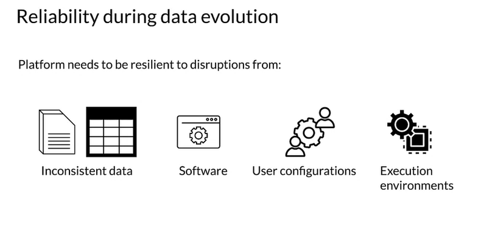
      
      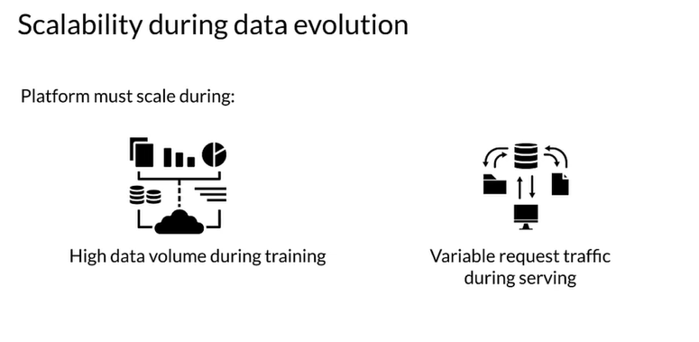
      
* Looking at schema versions to track data evolution
* Schema can drive other automated processes

#### Schema Environment

* Multiple schema versions -> Version control
* Maintraining verieties of schema

### Enterprise Data Storage

#### Feature Stores

* > A feature store is a central repository for storing documented, curated and access controlled features. Feature stores are valuable centralized feature repositories that reduce redundant work. They are also valuable because they enable teams to share data and discover data that is already available
  
  
* Online v.s. Offline
  
  
* Key aspects
  * Managing feature data from a single person to large enterprises
  * Scalable and performant access to feature data in training and serving
  * Provide consistant and point-in-time correct access to feature data
  * Enable discovery, documentation, and insights into your features

#### Data Warehouse

Data warehouses are repositories that aggregate data from one or more sources

* Some attributes
  * Aggregates data source
  * Processed and analyzed
  * Read optimized
  * Not real time
  * Follows schema
* Key features
  * Subject oriented
  * Integrated
  * Not volatile (previous data is not changed)
  * Time variant
* Advantages
  * Enhanced ability to analyze data
  * Time access to data
  * Enhanced data quality and consistency
  * High return on investment
  * Increased query and system performance
* Comparison with databases
  

#### Data Lakes

A data lake is a system or repository of data stored in its natural and raw format, which is usually in the form of blobs or files.

* Comparison with datawarehouse
  

**xhu Note**

| Terminology     | Description                                                                                             |
|-----------------|---------------------------------------------------------------------------------------------------------|
| Feature Store   | A central repository for storing documented, curated, and access-controlled features, specifically for ML. |
| Data Warehouse  | A subject-oriented repository for structured data optimized for fast read (system used for reporting and data analysis, and is considered a core component of business intelligence) |
| Data Lake       | A repository of data stored in its natural and raw format.                                                |
