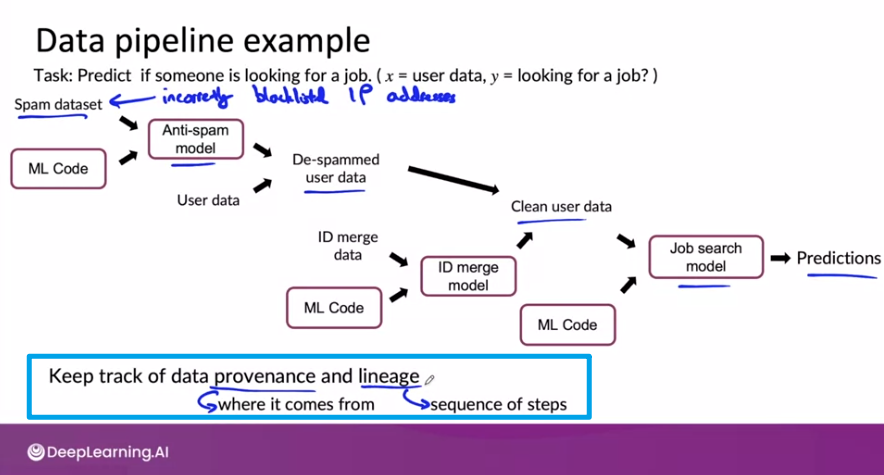
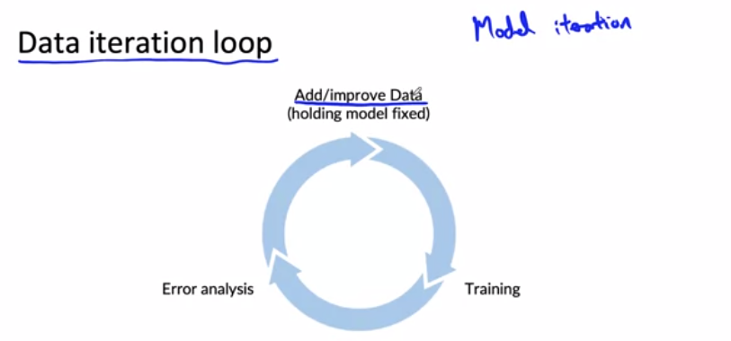
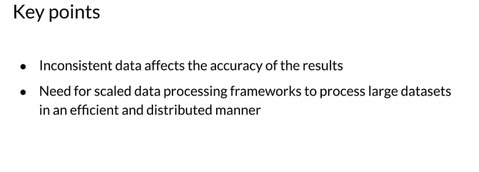
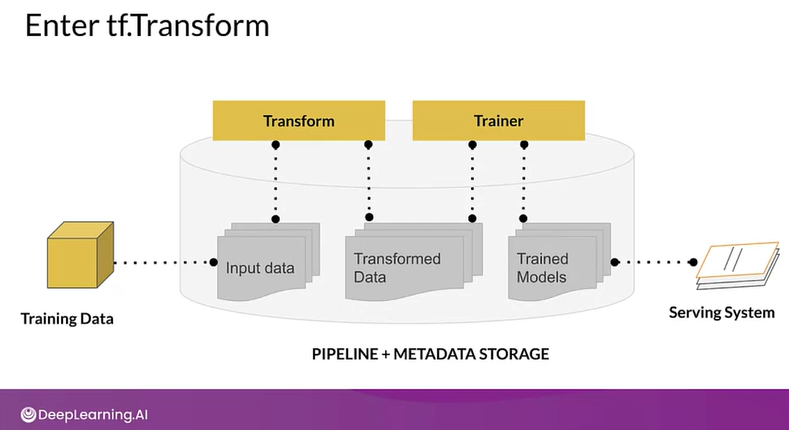
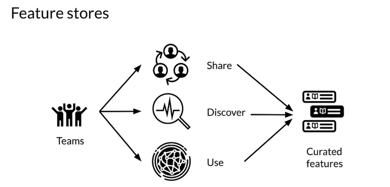
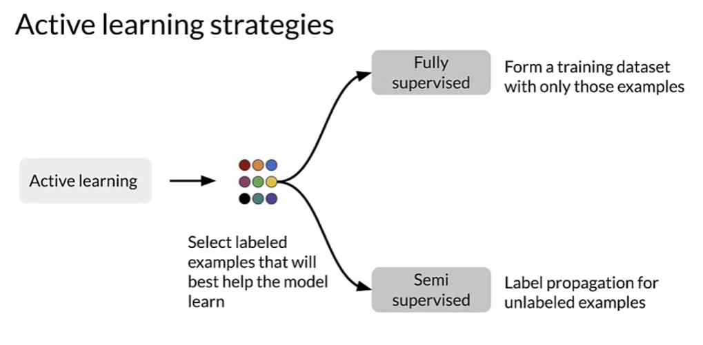
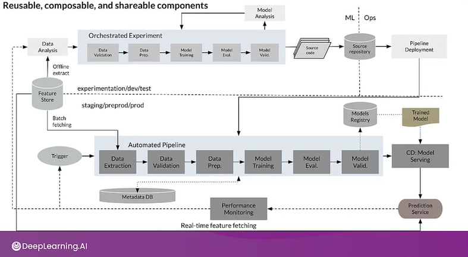

* Identify the key components of the ML Lifecycle.
* Define “concept drift” as it relates to ML projects.
* Differentiate between shadow, canary, and blue-green deployment scenarios in the context of varying degrees of automation.
* Compare and contrast the ML modeling iterative cycle with the cycle for deployment of ML products.
* List the typical metrics you might track to monitor concept drift.

# Course Scope

* C1 Introduction to Machine Learning in Production
* C2 Machine Learning Data Lifesycle in Production
* C3 Machine Learning Modeling Pipelines in Production
* C4 Deploying Machine Learning Models in Production

# C1 Introduction to Machine Learning in Production

## Blueprint

machine learning project modules


machine learning project lifecycle


Three parts are equally important: Code + Hyperparamters + Data >> ML Model

MLOps(Machine Learning Operations): an emerging discipline, and comprises a set of tools and principles to support progress throughthe ML project lifecycle. **Systematic way of thinking**

Stages: Scoping >> Data >> Modeling >> Deployment
Iterative: First deployment v.s. Maintainence

## 1. Scoping

### Scoping process

* Brainstorm business problems(not AI problem)
  * What are the top 3 things you wish were working better?
* Brainstorm AI solutions
* Assess the feasibility (dilligence): is it technically feasible?
  * Use external benchmark to evaluate(literature, other company, competitor)
  
  * Do we have features that are predictive?
  * The history of the project
  * Dilligence on value (Fermi estimates)
  
* Assess potential solutions
* Determinate milestones
  * Key specifications:
    * ML metrics (accuracy, presicion/recall, etc)
    * Software matrics(latency, throughput,etc.given compute resources)
    * Business metrcs(revenue, etc)
* Budget for resources
  * Resources needed(data, personnel, help from other teams)
  * Timeline

**xhu_Note**:

1. Separating problem identification from solution and use each 'method' to solve eacn 'problem' (learned from marker_cleanup_post too)
2. What to achieve > How to achieve
3. Two dimension coordination system is quite useful to help sorting

## 2. Data

### Define Data and Establish Baseline

Data defination: input X and target label Y

* Major type of data problems
  
  * Unstructured adata:
    * May or may not have huge collection of unalbeled exmpales x.
    * Human can label more data
    * Data agumentation more likely to be helpful
  * Structured data:
    * May be more difficult to obtain more data
    * Human labeling may not be possible
  * Small data:
    * Clean labels are critical
    
    * Can manually lookthrough dataset and fix labels
    * Can get all the labelers to talk to each others
  * Big Data:
    * Emphasis data process
    * (Big data sometimes have long tail of rare events in the input where clean labels are critical too < small data problem >)

**xhu note:** different Eng/Proj experiences might only map to one quadrant of above cordination system. (FT ?-> Structured + Big Data)

### Label and organize data

* Improving label consistancy
  * Have multiple labelers label same example
  * Where there is disagree,emt, have MLE, subhect matter export (SME)and /or labeler discuss defination of y to reach
  * If labelers believe that x does NOT contrain enough information, consider changing x
  * Iterate until it is hard to significate improve the data
  * Have a class/label to capture uncertainty: 0 , borderline, 1
  * 

* Human level performance (HLP)
  * Why HLP? Estimate Bayes error / irreducible error to help with error analysis and prioritiaztion
  

### Obtaining data

* Get into iteration loop as quickly as possible (Unless you have worked on the problem before and have sense of how much data it is need)
* Ask: How much data can we obtain in k days?
* Brainstorm list of data sources:
  
* Labeling data
  * Options: In-house v.s. outsourced v.s. crowdssourced
  * Don't increase data by more than 10x at a time
  * Label data yourself for a while to get the 'sense'

### Data pipeline (in iteration)

* Make sure the scripts/data is replicable
* POC (proof-of-concept) > Production phases:
  * 
* Balanced train/dev/test splits
  * distribute 3 set equally in small data problems
  * random split will be representative
* Example: **keep track of data provenace and lineage** (using meta data is one of the methods)
    

## 3. Modeling

AI system = Code (algorithm/model) + Data
Model-centic AI development v.s. Data-centric AI development

### Key changllenges

* Model development is an iterative process
  * 
* Challenges in model development
  * Do well in : training set > dev/test set > business metric/project goals
  * Why low avg error isn't good enough: single std can not reflact on key slices
* Rare classes
  * Skewed data distribution
  * Accuracy in rare classes

### Selecting and training model

* Establish a baseline
  * Establish a baseline level of performace
  * Unstructured and structured data: human good at unstructured v.s. machine good at structured
  * 
* Tips for getting started
  * Starting on modeling
    * literacture search to see what's possible (courses, blogs, open-source projects)
    * Find open-source implementations if avaiblable
    * A reasonable algorithm with good data will often outperform a great algorithm with no so good data > lastest != greatest
  * Sanity-check for code and algorithm
    * overfit a small training dataset before the large one

### Error analysis

* Use tags can help catergoize issue
    
* Prioritizing what to work on
  * How much room for improvement there is
  * How frequently that category appears
  * How easy is to improve accuracy in that catergory
  * How important it is to improve in that catergory
* Adding/improving data for specific categories (for target catego)
  * Collect more data
  * Use data aguementation to get more data
  * Importve label accuracy / data quality

Example Analysis

Skewed dataset : large portion of data is '0'


### Performace auditing

Auditing framework

* Check for accuracy, fiarness/bias, and other probelms
  * Brainstore what might go wrong
  * Establish metrics

### Data iteration Loop (during iteration of model)

**Model-centric view:** Take the data you have and develop a model that does as well as possible > Hold the data fixed and iteratively improve the code/mode
**Data-centric view:** The quality of the data is paramount. Use tools to improve the data quality; this will allow multiple models to do well > Hold the code fixed and iteratively improve the data

Example of data augmentation analysis


* Data augmentaiton
  * Goal: Create 'realistic' examples that algotiythm does poorly on but humans (or other baseline) can do well on
* Data iteration
  * 
  * for unstructure data: If the model is sufficiently large (less bias), adding data will not hurts accuracy
  * for structure data: Adding features. (collebrative filter v.s. content filter aka cold-start filter)
* Experiment tracking (systematic)
  * 


## 4. Deployment

### Key challenges

* Concept drift & Data drift
  * Concept drift: X-> Y mapping drift
  * Data drift: training set/test set etc. gradual change / sudden shock
* Software engineering issues
  * Realtime or Batch
  * Cloud vs. Edge/Browser
  * Coupute resources (CPU/GPU/memory)
  * Latency, thoughput(QPS: query per seconds - e.g. 500ms)
  * Security and privacy

### Deployment patterns

* Common deployment cases:
  * New oriduct/capaibility
  * Automate/assist with manual task
  * Replace previous ML system

* Common deployment methods:
  * Canary deployment : Gradual ramp up with monitoring or Rollback
  * Blue green deployment: Switch to new model directly but can swtich back
  * Degree of automation:
  Human only >> Shadow mode >> AI assistance >> Partial automation >> Full automation


### Monitoring + Maintainance


Ref:

* <https://papers.nips.cc/paper/2015/file/86df7dcfd896fcaf2674f757a2463eba-Paper.pdf>
* <http://arxiv.org/abs/2011.09926>
* <http://arxiv.org/abs/2010.02013>

## C1 References

This is a compilation of resources including URLs and papers appearing in lecture videos.

Overall resources:

Konstantinos, Katsiapis, Karmarkar, A., Altay, A., Zaks, A., Polyzotis, N., … Li, Z. (2020). Towards ML Engineering: A brief history of TensorFlow Extended (TFX).
<http://arxiv.org/abs/2010.02013>

Paleyes, A., Urma, R.-G., & Lawrence, N. D. (2020). Challenges in deploying machine learning: A survey of case studies.
<http://arxiv.org/abs/2011.09926>

Week 1: Overview of the ML Lifecycle and Deployment
Concept and Data Drift
<https://towardsdatascience.com/machine-learning-in-production-why-you-should-care-about-data-and-concept-drift-d96d0bc907fb>

Monitoring ML Models
<https://christophergs.com/machine%20learning/2020/03/14/how-to-monitor-machine-learning-models/>

A Chat with Andrew on MLOps: From Model-centric to Data-centric AI:
<https://youtu.be/06-AZXmwHjo>

Konstantinos, Katsiapis, Karmarkar, A., Altay, A., Zaks, A., Polyzotis, N., … Li, Z. (2020). Towards ML Engineering: A brief history of TensorFlow Extended (TFX).
<http://arxiv.org/abs/2010.02013>

Paleyes, A., Urma, R.-G., & Lawrence, N. D. (2020). Challenges in deploying machine learning: A survey of case studies.
<http://arxiv.org/abs/2011.09926>

Sculley, D., Holt, G., Golovin, D., Davydov, E., & Phillips, T. (n.d.). Hidden technical debt in machine learning systems. Retrieved April 28, 2021, from Nips.cc

<https://papers.nips.cc/paper/2015/file/86df7dcfd896fcaf2674f757a2463eba-Paper.pdf>

Week 2: Select and Train Model
Establishing a baseline
<https://blog.ml.cmu.edu/2020/08/31/3-baselines/>

Error analysis
<https://techcommunity.microsoft.com/t5/azure-ai/responsible-machine-learning-with-error-analysis/ba-p/2141774>

Experiment tracking
<https://neptune.ai/blog/ml-experiment-tracking>

Brundage, M., Avin, S., Wang, J., Belfield, H., Krueger, G., Hadfield, G., … Anderljung, M. (n.d.). Toward trustworthy AI development: Mechanisms for supporting verifiable claims∗. Retrieved May 7, 2021

<http://arxiv.org/abs/2004.07213v2>

Nakkiran, P., Kaplun, G., Bansal, Y., Yang, T., Barak, B., & Sutskever, I. (2019). Deep double descent: Where bigger models and more data hurt. Retrieved from
<http://arxiv.org/abs/1912.02292>

Week 3: Data Definition and Baseline
Label ambiguity

<https://arxiv.org/pdf/1706.06969.pdf>

Data pipelines
<https://cs230.stanford.edu/blog/datapipeline/>

Data lineage
<https://blog.tensorflow.org/2021/01/ml-metadata-version-control-for-ml.html>

MLops
<https://cloud.google.com/blog/products/ai-machine-learning/key-requirements-for-an-mlops-foundation>

Geirhos, R., Janssen, D. H. J., Schutt, H. H., Rauber, J., Bethge, M., & Wichmann, F. A. (n.d.). Comparing deep neural networks against humans: object recognition when the signal gets weaker∗. Retrieved May 7, 2021, from Arxiv.org website:

# C2 Machine Learning Engineering for Production (MLOps) Specialization


## C2W1 Collecting,Labeling and Validating Data

* Production ML = ML development + software development
  
  
* Managing the entire life cycle of data
  * Labeling
  * Feature space coverage
  * Minimal dimensionality
  * Maximum predictive data
  * Fairness
  * Rare conditions
* Modern software development (Criterias)
  * Scalability
  * Extensibility
  * Configuration
  * Consistency & reproducibility
  * Safety & security
  * Modularity
  * Testability
  * Monitoring
* Challenges in production grade ML
  * Build itergrated ML system
  * Continuous operate it in production
  * Handle continuously changing data
  * Optimize compute resource costs

### ML Pipelines


### Collecting Data

data collect > ingest > prepare

* Importance of data quality
* Data pipeline: data collection, ingestion and preparation
* Data collection and monitoring


Key points:
  
  

**xhu NOTE**

* Representational harms include perpetuating harmful stereotypes about or minimizing the existence of a social group, such as a racial, ethnic, gender, or religious group. Machine learning algorithms often commit representational harm when they learn patterns from data that have algorithmic bias.
* Rater categorise: generalist , experts & targer users

### Labeling Data

* Model performance decays over time, and model retraining helps improve or maintain performance.
* Data labeling is a key part of supervised learning and needs to be approached based on the specific problem and domain.


* Direct Labeling v.s. Derived Labeling (Human raters)

**xhu note**
Direct Labeling (aka Process Feedback) labels come from monitoring predictions, not from a "rater" as in this example. But what id we don't have data to log?:

* Use a heuristic for a first launch, then train a system based on logged data.
* Use logs from a similar problem to bootstrap your system.
* Use human raters to generate data by completing tasks.
* ref:<https://developers.google.com/machine-learning/data-prep/construct/collect/label-sources>

### Validating Data

#### Data Issues

* drift and skel
  * data and concept drift
  * schema skel
  * distribution skek

| Concept | Description |
|-------------|-------------|
| Drift       | Changes in data over time, such as data collected once a day |
| Skew        | Difference between two static versions or different sources, such as training set and serving set |


#### Detecting data issues

* detecing schema skew
  * Training and serving data do not conform to the same schema
* deteching distribution skew
  * dataset shift -> covariate or concept shift
  

**data requires continuous evaluation**


TensorFlow Data Validation


<https://github.com/cdfoundation/sig-mlops/blob/main/roadmap/2022/MLOpsRoadmap2022.md>

## C2W2 Feature Engineering, Transformation and Seletion

### Feature Engineering

#### Introduction

* Squeezing the most out of data
  * Making data usefulbefore training a model
  * Representing data in forms that help models learn
  * Increasing predictive quality
  * Reducing dimentionalitywith feathre engineering
* The art of feature engineering
  * 
* How feature engineering is done ina typical ML pipeline
  * 
* Feature engineering process
  * 

#### Preprocessing Operations

* Main preprocessing operations
  * Data cleansing, Feature tuning, Representation transofmration, Feature extractation, Feature construction
* Mapping raw data into features (Vectorizel)
  * 
* Mapping numeric values
* Mapping catergorical values
  * 
* Empirical knowledge of data
  * Text  - stemming, lemmatization, TF-IDF embedding lookup
  * Imges- clipping, resizing, cropping, blur, Canny filters, Sober filters
  

#### Techniques

* Feature Scaling
  * Converts values from natural range into a prescribed range. e.g. (0,255) to (-1,1)
  * Benefits: coverge faster, lower NaN, model learns the right weights
* Normalization and Standardization
  * 
  * 
* Bucketizing / Binning
* Other techniques
  * Dimensionality reduction in embeddig
  * (TensorFlow embedding projector for high dimension data visualize)
  * Feature corsses: Combines multiple features together into a new feature(space)/encode same into in fewer features, e.g A, B -> A x B
  * Feature coding: transforming categorical to a continuous variables
  

### Feature Transform in scale


#### Preprocessing Data at Scale

  

* Inconsistancies in feature engineering (important)
  * traning & serving code paths are different
  * diverse delopments scenarios: mobile - TF lite, server - TF Serving, Web -TF JS
  * risk of introducing training-serving skew
  * skel will lower the performace of your serving model
* Preprocssing granularity
  * 
* Pre-procssing training dataset
    |                            | Pre-processing training dataset | Transforming within the model |
    |----------------------------|---------------------------------|-------------------------------|
    | Pros                       | - Run-once                       | - Easy iteration              |
    |                            | - Compute on the entire dataset | - Transformation guarantees   |
    | Cons                       | - Transformations reproduced at serving | - Slower iteration |
    |                            | - Ling model latency            | - Expensive transforms       |
    |                            | - Transformations per batch: skew |                               |
* Optimizing instance-level transformations
  * indirectly affect traning efficiency
  * typically accelerators sit idle while the CPUs transform
  * Solutions:
    * Prefetching transforms for better accelerator efficiency
* Sum of Challanegs
  * Balancing the predictive performace
  * Full-pass transformations on traning data
  * Optimizing instance0level transforations for better traning efficiency
  

#### TensorFlow Transform

* Benefits of using TensorFlow Transform
  
* Applied feature transformations
* tf.Transform Analyzers
  
  
  
  
  
  

**xhu Note**

<https://www.tensorflow.org/tfx/guide/tft_bestpractices>

### Feature Selection

#### Feature Spaces

* Introductions to Feature Space
  * N dimesional space defined by N features
  * Not including the target label
      X = [x1, x2, x3, ..., xN]
  * Feature space coverage:
    * Same numerical ranges
    * Same classes
    * Similar characteristics for image data
    * Similar vocabulary, syntax and sematics for NLP data
  * 

#### Feature Selection

* Why?
  * identify featues that best represent the data
  * remove featues that don't influence the outcome
  * reduce the size of the feature space
  * resuce the resource requirements and model complexity (IO, storage, and inference costs)
* How?
  * Unsupervised
    * Feature-target variable relationship NOT considered
    * Remove redundant features(correlation)
  * Supervised
    * Feature-target variable relationship considered
    * Select features that are most relevant to the target variable

* Supervised Feature Selection Methods:
  
  
  * Filter Methods: e.g.Pearson correlation
      Filter methods suffer from inefficiencies as they need to look at all the possible feature subsets.
      
  * Wrapper Methods
      Wrapper methods are based  on the greedy algorithm and thus solutions are slow to compute.
      
  * Embedded Methods

**xhu Note**

<https://www.tensorflow.org/tfx/guide#tfx_pipelines>

## C2W3 Data Journey and Data Storage

### Data Journey

#### The data journy

* Raw features and labels
* Input-output map
* ML model to learn the map
  

#### Data provenace

  

#### Data lineage

  

#### Data versioning

  

### ML metadata

Metadata: Tracking artifacts and pipeline changes (Using ML metadata to track changes)
Ordinary ML data pipeline

* Data Validation -> Data Transformation


|         Units                   | Types           | Relationships |
|----------------------------|-----------------|-----------------|
| Artifact                       | ArtifactType   | Event            |
| Execution                     | ExecutionType | Attribution   |
| Context                        | ContextType   | Association    |


#### ML Data

* Architecture and nomenclature
* Tracking metadata flowing between components in pipeline


```html
Data model ref: https://www.tensorflow.org/tfx/guide/mlmd#data_model

The Metadata Store uses the following data model to record and retrieve metadata from the storage backend.

* ArtifactType describes an artifact's type and its properties that are stored in the metadata store. You can register these types on-the-fly with the metadata store in code, or you can load them in the store from a serialized format. Once you register a type, its definition is available throughout the lifetime of the store.
* An Artifact describes a specific instance of an ArtifactType, and its properties that are written to the metadata store.
An ExecutionType describes a type of component or step in a workflow, and its runtime parameters.
* An Execution is a record of a component run or a step in an ML workflow and the runtime parameters. An execution can be thought of as an instance of an ExecutionType. Executions are recorded when you run an ML pipeline or step.
* An Event is a record of the relationship between artifacts and executions. When an execution happens, events record every artifact that was used by the execution, and every artifact that was produced. These records allow for lineage tracking throughout a workflow. By looking at all events, MLMD knows what executions happened and what artifacts were created as a result. MLMD can then recurse back from any artifact to all of its upstream inputs.
* A ContextType describes a type of conceptual group of artifacts and executions in a workflow, and its structural properties. For example: projects, pipeline runs, experiments, owners etc.
* A Context is an instance of a ContextType. It captures the shared information within the group. For example: project name, changelist commit id, experiment annotations etc. It has a user-defined unique name within its ContextType.
* An Attribution is a record of the relationship between artifacts and contexts.
* An Association is a record of the relationship between executions and contexts.
```

### Evolving Data

#### Schema Development

* Schema includes:
  * Feature name
  * Feature type: float, int, string, etc.
  * Required: True/False
  * Valency: Min, Max, etc.(features with multiple values)
  * Domain: Categorical, Numerical, Range, etc.
  * Default value
      
      
      
      
      
* Looking at schema versions to track data evolution
* Schema can drive other automated processes

#### Schema Environment

* Multiple schema versions -> Version control
* Maintraining verieties of schema

### Enterprise Data Storage

#### Feature Stores

* A feature store is a central repository for storing documented, curated and access controlled features. Feature stores are valuable centralized feature repositories that reduce redundant work. They are also valuable because they enable teams to share data and discover data that is already available
  
  
* Online v.s. Offline
  
  
* Key aspects
  * Managing feature data from a single person to large enterprises
  * Scalable and performant access to feature data in training and serving
  * Provide consistant and point-in-time correct access to feature data
  * Enable discovery, documentation, and insights into your features

#### Data Warehouse

Data warehouses are repositories that aggregate data from one or more sources

* Some attributes
  * Aggregates data source
  * Processed and analyzed
  * Read optimized
  * Not real time
  * Follows schema
* Key features
  * Subject oriented
  * Integrated
  * Not volatile (previous data is not changed)
  * Time variant
* Advantages
  * Enhanced ability to analyze data
  * Time access to data
  * Enhanced data quality and consistency
  * High return on investment
  * Increased query and system performance
* Comparison with databases
  

#### Data Lakes

A data lake is a system or repository of data stored in its natural and raw format, which is usually in the form of blobs or files.

* Comparison with datawarehouse
  

**xhu Note**

| Terminology     | Description                                                                                             |
|-----------------|---------------------------------------------------------------------------------------------------------|
| Feature Store   | A central repository for storing documented, curated, and access-controlled features, specifically for ML. |
| Data Warehouse  | A subject-oriented repository for structured data optimized for fast read (system used for reporting and data analysis, and is considered a core component of business intelligence) |
| Data Lake       | A repository of data stored in its natural and raw format.                                                |

## C2W4 Advanced Labeling, Augmentation and Data Preprocessing

### Advanced Labeling

Outline:

* Semi-supervised learnig
* Active learning
* Weak supervision with Snorkel

Why?

* Manual labeling is expensive
* Unlabeled data is usually abundant and cheap
* Unlabeled data contrains useful information that can improve model

* Semi-supervised Learning
  *Label propagation
  

* Active Learning
  
  
  
  
* Weak supervision
  Weak supervision is baout leveraging higher-kevek abd/or noisier input from subject matter exports (SMSEs)
  * Unlabeled data, without ground-truth labels
  * One or more weak supervision sources
    * A list of heuristic that can automate labeling
    * Typically provided by SMEs
  * Noisy labels have certrain probability of being correct, not 100%
  * Objective: learn a generative model to determine weights of weak supervision sources
  * Snorkel
    

**xhu Note**


* Semi-supervised learning:
  * Applied the best of supervised and unsupervised approaches
  * Using a small amount of labeled data and boosts model accuracy
* Active Learning:
  * Selects the most informative data points s(for SME, e.g.human) to label
  * Improves predictive accuracy
* Weak Supervision:
  * Uses heuristics to apply noisy labels to unlabeled examples
  * Snorkel is handy frameowkr for weak supervision

### Data Augmentation


* It generates artificial data by creating new examples which are variants of the original data
* It increases the diversity and number of examples in the traning data
* Provides means to improves accuracy, generalization, and avoiding overfitting

## C2 References

Overall resources:
Konstantinos, Katsiapis, Karmarkar, A., Altay, A., Zaks, A., Polyzotis, N., … Li, Z. (2020). Towards ML Engineering: A brief history of TensorFlow Extended (TFX).
<http://arxiv.org/abs/2010.02013>

Paleyes, A., Urma, R.-G., & Lawrence, N. D. (2020). Challenges in deploying machine learning: A survey of case studies.
<http://arxiv.org/abs/2011.09926>

Week 1: Collecting, Labeling and Validating Data
ML code fraction:

MLops

Data 1st class citizen

Runners app

Rules of ML

Bias in datasets

Logstash

Fluentd

Google Cloud Logging

AWS ElasticSearch

Azure Monitor

TFDV

Chebyshev distance

Sculley, D., Holt, G., Golovin, D., Davydov, E., & Phillips, T. (n.d.). Hidden technical debt in machine learning systems. Retrieved April 28, 2021, from Nips.cc
<https://papers.nips.cc/paper/2015/file/86df7dcfd896fcaf2674f757a2463eba-Paper.pdf>

Week 2: Feature Engineering, Transformation and Selection
Mapping raw data into feature

Feature engineering techniques
<https://developers.google.com/machine-learning/crash-course/representation/feature-engineering>

Facets

Embedding projector

Encoding features

TFX:

<https://www.tensorflow.org/tfx/guide#tfx_pipelines>

<https://ai.googleblog.com/2017/02/preprocessing-for-machine-learning-with.html>

Breast Cancer Dataset

Week 3: Data Journey and Data Storage
Data Versioning:

<https://dvc.org/>

<https://git-lfs.github.com/>

ML Metadata:

<https://www.tensorflow.org/tfx/guide/mlmd#data_model>

<https://www.tensorflow.org/tfx/guide/understanding_custom_components>

Chicago taxi trips data set:

<https://data.cityofchicago.org/Transportation/Taxi-Trips/wrvz-psew/data>

<https://archive.ics.uci.edu/ml/datasets/covertype>

Feast:

<https://cloud.google.com/blog/products/ai-machine-learning/introducing-feast-an-open-source-feature-store-for-machine-learning>

<https://github.com/feast-dev/feast>

<https://blog.gojekengineering.com/feast-bridging-ml-models-and-data-efd06b7d1644>

Week 4: Advanced Labeling, Augmentation and Data Preprocessing
Hand Labeling

Weak supervision

Snorkel

How do you get more data?

Advanced Techniques

Images in tensorflow

CIFAR-10

<https://www.cs.toronto.edu/~kriz/cifar.html>

<https://www.tensorflow.org/datasets/catalog/cifar10>

Weather dataset

Human Activity Recognition

Papers

Label Propagation:

Iscen, A., Tolias, G., Avrithis, Y., & Chum, O. (2019). Label propagation for deep semi-supervised learning.
<https://arxiv.org/pdf/1904.04717.pdf>

# C3 Machine Learning Modeling Pipelines in Production


## C3W1 Neural Architecture Search

### Hyperparameter Tuning

* Neural architecture search (NAS) is a technique for automating the design of artificla neural networks
* It helps finding the optimal architecture
* This is a search over a huge space of possible architectures
* AutoML is an algorithm to automate this search

Types of parameters in ML Models

* Trainable parameters:
  * learned by the algotihm during training
  * e.g.weights and biases
* Hyperparameters:
  * set before launching the learning process
  * not updated in each training step
  * e.g.learning rate, batch size, number of unit in dense layers, etc.


> Keras autotuner: <https://keras.io/api/keras_tuner/>.

```python
# KerasTuner: comes with Bayesian Optimization, Hyperband, and Random Search algorithms built-in.
import kerastuner as kt
from tensorflow import keras

# Define imports
from kerastuner.engine import base_tuner
from typing import NamedTuple, Dict, Text, Any, List
from tfx.components.trainer.fn_args_utils import FnArgs, DataAccessor
import tensorflow as tf
import tensorflow_transform as tft

# Declare namedtuple field names
TunerFnResult = NamedTuple('TunerFnResult', [('tuner', base_tuner.BaseTuner),
                                             ('fit_kwargs', Dict[Text, Any])])

def model_builder(hp):
  '''
  Builds the model and sets up the hyperparameters to tune.

  Args:
    hp - Keras tuner object

  Returns:
    model with hyperparameters to tune
  '''

  # Initialize the Sequential API and start stacking the layers
  model = keras.Sequential()
  model.add(keras.layers.Input(shape=(28, 28, 1), name=_IMAGE_KEY))
  model.add(keras.layers.Flatten())

  # Tune the number of units in the first Dense layer
  # Choose an optimal value between 32-512
  hp_units = hp.Int('units', min_value=32, max_value=512, step=32)
  model.add(keras.layers.Dense(units=hp_units, activation='relu', name='dense_1'))

  # Add next layers
  model.add(keras.layers.Dropout(0.2))
  model.add(keras.layers.Dense(10, activation='softmax'))

  # Tune the learning rate for the optimizer
  # Choose an optimal value from 0.01, 0.001, or 0.0001
  hp_learning_rate = hp.Choice('learning_rate', values=[1e-2, 1e-3, 1e-4])

  model.compile(optimizer=keras.optimizers.Adam(learning_rate=hp_learning_rate),
                loss=keras.losses.SparseCategoricalCrossentropy(),
                metrics=['accuracy'])

  return model

def tuner_fn(fn_args: FnArgs) -> TunerFnResult:
  """Build the tuner using the KerasTuner API.
  Args:
    fn_args: Holds args as name/value pairs.

      - working_dir: working dir for tuning.
      - train_files: List of file paths containing training tf.Example data.
      - eval_files: List of file paths containing eval tf.Example data.
      - train_steps: number of train steps.
      - eval_steps: number of eval steps.
      - schema_path: optional schema of the input data.
      - transform_graph_path: optional transform graph produced by TFT.
  
  Returns:
    A namedtuple contains the following:
      - tuner: A BaseTuner that will be used for tuning.
      - fit_kwargs: Args to pass to tuner's run_trial function for fitting the
                    model , e.g., the training and validation dataset. Required
                    args depend on the above tuner's implementation.
  """

  # Define tuner search strategy
  tuner = kt.Hyperband(model_builder,
                     objective='val_accuracy',
                     max_epochs=10,
                     factor=3,
                     directory=fn_args.working_dir,
                     project_name='kt_hyperband')

  # Load transform output
  tf_transform_output = tft.TFTransformOutput(fn_args.transform_graph_path)

  # Use _input_fn() to extract input features and labels from the train and val set
  train_set = _input_fn(fn_args.train_files[0], tf_transform_output)
  val_set = _input_fn(fn_args.eval_files[0], tf_transform_output)


  return TunerFnResult(
      tuner=tuner,
      fit_kwargs={ 
          "callbacks":[stop_early],
          'x': train_set,
          'validation_data': val_set,
          'steps_per_epoch': fn_args.train_steps,
          'validation_steps': fn_args.eval_steps
      }
  )

tuner = tfx.components.Tuner(
    module_file=_tuner_module_file,
    examples=transform.outputs['transformed_examples'],
    transform_graph=transform.outputs['transform_graph'],
    schema=schema_gen.outputs['schema'],
    train_args=trainer_pb2.TrainArgs(splits=['train'], num_steps=500),
    eval_args=trainer_pb2.EvalArgs(splits=['eval'], num_steps=100)
    )
```

### Automated Machine Learning  (AutoML)


#### Types of Search Spaces

* Macro Architecture Search Space: Contrains individual layers and connection types
* Micro Architecture Search Space: neural architecture search builds a neural network from cells where each cell is a smaller network


#### Search Strageties

* Grid Search
  * Exhaustive search over a specified parameter grid
* Random Search
* Bayesian Optimization
  
* Evolutionary Algorithms
  
* Reinforcement Learning
  

#### Measuring AutoML Efficiency

Strategies to reduce the cost:

* Lower fidelity estimates
  * 
* Learning Curve Extrapolation
  * 
* Weight Inheritance/Network Morphism
  * 

#### AutoML on the Cloud

Popular Cloud Offerings:

* Amazon SageMaker Autopilot (Database-ish. sutiabel for multiple use cases for large datasets)
  * Automatically trains and tunes the best machine learning models for classification or regression based on your data
  * Key features:
    * Quick Iteration
    * High quality models
    * Performace ranked
    * Selected features
    * Notebooks for reproducibility
  
* Microsoft Azure Automated Machine Learning
  * Quick customization: model + control settings
  * Automated Feature Engineering
  * Data Visualization
  * Intelligent stopping
  * Experiment summaries
  * Matric visualization
  * Model Interpretability
  * Pattern Discovrty
* Google Cloud AutoML
  * Accessible to beginners
  * Train High-quality models
  * Neatural Architecture Search
  * Transfer Learning
  * GUI based
  * Pipeline life-cycle
  * Data labeling
  * Data cleaning


Papers：
<https://arxiv.org/pdf/1611.01578>
<https://arxiv.org/pdf/1603.01670>
<https://arxiv.org/pdf/1808.05377>

## C3W2 Model Resource Management Techniques

### Dimentionality Reduction

Why is high-dimensional data a problem?

* More dimensions -> more features
* Risk of overfitting
* Distances grown more similar
* No clear boundaries between clusters
* Concentration phenomenon for Euclidean distance

Why are mode feautres a problem?

* Redundant / irrelevant features
* More noise added than signal
* Hard to interpret and visualize
* Hard to store and process data


Why reduce dimentionality?

* Storage
* Computational
* Consistency
* Visualization

Major techniques for dimensionality reduction

* Engineering
  * Feature Engineering
  
* Selection

Approches of conduction dimensionality reduction

* Mannually dimensionality reducton
* Algorithmic dimensionality reducton
  * Linear dimentionality reduction: project n-dimensional data into a k-dimensional subspace (k<<n)
  
    * Principal component analysis (PCA)
    
  * More dimensionality reduction algorithms
    
    * Singular value decomposition (SVD)
    * Independent component analysis (ICA)
      
    * Non-negative Matrix Factorization (NMF)

**xhu Note**
Data Science integrates all data generation, data preprocessing and data analysis (mining) techniques. Dimensionality reduction is only a preprocessing step.

1. Principal Component Analysis (PCA) on numerical data.
2. Single Value Decomposition (SVD) on image data
3. Non-negative Matrix Factorization (NMF) on text data.

### Quantization & Pruning

* Trends in adoption o smart devices
* Factors dirving this trend
  * Demands move ML capabilities from cloud to on-devices
  * Cost-effitiveness
  * Compliance with privacy regulations


#### Quantization

involves transforming a model into an equivalent representation that uses parameters and computations at a lower precision

e.g. quantizing img


Why quantize neural networks?

* Neural networks -> more parameters -> take up more space
* Shrinking model file size
* Reduce computational resources
* Make models run faster and use less power with low-precision

Benefits of quantization

* Faster compute
* Low memory bandwidth
* Low power
* Integer operations supported across CPU/DSP/NPUs


Trade-offs


* Accuracy

Post-training Quantization

Theoratically can do quantization during or after training

* Post-training quantization: a conversion technique that can reduce model size while also improving CPU and hardware accelerator latency with little degradation in model accuracy -> quantize an already trained TensorFlow model
  * Float16 is especially useful when you plan to use a GPU > best balanced?
  
  * Alternatively, consider using quantization aware training if the loss of accuracy is too great

```python
import tensorflow as tf
converter = tf.lite.TFLiteConverter.from_saved_model(saved_model_dir)
converter.optimizations = [tf.lite.Optimize.OPTIMIZE_FOR_SIZE]

tflite_quat_model = convert.convert()
```

Quantization Aware Training(QAT)

* Inserts fake quantization nodes in the forward pass
* Rewrites the graph to emulate quantized inference
* Reduce the loss of acuracy due to quantization
* Resulting model contrains all data to be quantized according to spec


```python
import tensorflow_model_optimization as tfmot

model = tf.keras.models.Sequential([
  ...
])

# Quantize the entire model
quantize_model = tfmot.quantization.keras.quantize_model(model)

# Continue with training as usual
quantize_model.compile(...)
quantize_model.fit(...)


# Quantize the parts of the model
quantize_annotate_layer = tfmot.quantization.keras.quantize_annotate_layer
model = tf.keras.models.Sequential([
  ...,
])

quantize_model = tfmot.quantization.keras.quantize_apply(model)

```

Reference
<https://blog.tensorflow.org/2020/04/quantization-aware-training-with-tensorflow-model-optimization-toolkit.html>

#### Pruning

to remove parts of the model that did not contribute substantially to producing accurate results > zeroing out insignificant (i.e. low magnitude) weights


```python
# Get the pruning method
prune_low_magnitude = tfmot.sparsity.keras.prune_low_magnitude

# Compute end step to finish pruning after 2 epochs.
batch_size = 128
epochs = 2
validation_split = 0.1 # 10% of training set will be used for validation set. 

num_images = train_images.shape[0] * (1 - validation_split)
end_step = np.ceil(num_images / batch_size).astype(np.int32) * epochs

# Define pruning schedule.
pruning_params = {
      'pruning_schedule': tfmot.sparsity.keras.PolynomialDecay(initial_sparsity=0.50,
                                                               final_sparsity=0.80,
                                                               begin_step=0,
                                                               end_step=end_step)
}

# Pass in the trained baseline model
model_for_pruning = prune_low_magnitude(baseline_model, **pruning_params)

# `prune_low_magnitude` requires a recompile.
model_for_pruning.compile(optimizer='adam',
              loss='sparse_categorical_crossentropy',
              metrics=['accuracy'])

model_for_pruning.summary()
```

Model sparsity

* Larger models -> more parameters -> more memory -> less efficient
* Sparse models -> less parameters -> less memory -> more efficient

What's special about pruning?

* Better storage and/or transmission
* Gain speedups in CPU and some ML accelerators
* Can be used in tandem with quantization to get additional benefits
* Unlock performance improvements

* The Lottery Ticket Hypothesis <https://arxiv.org/abs/1803.03635>


**xhu Note**
Although pruning can make additional benefits such as improved transmission and gains speed increases in the CPU, there are still significant limitations of this method to solve architectures on a larger scale.

## C3W3 High-Performance Models

### Distributed Training


* Types of distributed training
  * Data parallelism: In data parallelism, the model is replicated on different accelerators (GPU/CPU) and data is split between them
  
  
  * Model parallelism: When models are too large to fit on a single device then they can be divided into partitions, assigning different partitions to different acceleators

* Distribution Strategy. API e.g. tf.distribute.Strategy
  * **One Device Strategy**: This strategy is used when you want to run on a single device - no distribution. Typical usage of this strategy is testig your code on a single device before scaling to multiple devices / distribute codes.
  * **Mirrored Strategy**: This strategy is used when you want to run on multiple GPUs on one machine
    * Creates a replica per GPU <> Variables are mirrored
    * Weight updating is done using efficient cros-device communication algorithms (all-reducr algorithms)
  * **Parameter Server Strategy**: This strategy is used when you want to run on multiple machines. Some machines are designated as workers and some as parameter servers
    * Parameter servers store variables so that workers can perform computtions on them
    * Implements asynchronous data parallelism by default
  * Multi-Worker Mirrored Strategy: This strategy is used when you want to run on multiple machines with multiple GPUs on each machine
  * Central Storage Strategy
  * TPU Strategy


### High Performance Models

#### High Performance Ingestion

Why input pipelines?

Accelerators are a key part of high-performance modeling, training, and inference, but accelerators are also expensive, so it's important to use them efficiently > That means keeping them busy, which requires you to supply them with enough data fast enough.

* Full utilization of hardware resources


How to optimize pipline performance?

* Prefetching
  
* Parallelizing data extraction and transformation
  * Parallelize data extraction
    * Perfer local storage as it takes significantly less time than read data from remote storage
    * Maximize the aggregate badwidth of the remote storage by reading more files
    
  * Parallelize data transformation
    * Post data loading, the inputs may need preprocessing
    * Element-wise preprocessing can be parallelized accross CPU cores
    * The optimal value for the level of parallelism depends on:
      * Size of the data
      * Cost of the transformation
      * Number of CPU cores
    * Use tf.data.experimental.AUTOTUNE to automatically tune the level of parallelism
* Caching
  * In memory: tf.data.Dataset.cache()
  * Disk: tf.data.Dataset.cache(filename=)
  
* Reduce memory

#### High Performance Modelling


Ref:
<https://arxiv.org/abs/1811.06965>

### Knowledge Distillation

Why knowledge distillation? -> Sophisticated models and their problems

* Larger sophisticated models become complex
* Complex models learn complex tasks
* Can we express this learning more efficiently?

To distill or concertrate this complexity into smaller networks


Teacher-student model

```python
class Distiller(keras.Model):

  # Needs both the student and teacher models to create an instance of this class
  def __init__(self, student, teacher):
      super(Distiller, self).__init__()
      self.teacher = teacher
      self.student = student


  # Will be used when calling model.compile()
  def compile(self, optimizer, metrics, student_loss_fn,
              distillation_loss_fn, alpha, temperature):

      # Compile using the optimizer and metrics
      super(Distiller, self).compile(optimizer=optimizer, metrics=metrics)
      
      # Add the other params to the instance
      self.student_loss_fn = student_loss_fn
      self.distillation_loss_fn = distillation_loss_fn
      self.alpha = alpha
      self.temperature = temperature


  # Will be used when calling model.fit()
  def train_step(self, data):
      # Data is expected to be a tuple of (features, labels)
      x, y = data

      # Vanilla forward pass of the teacher
      # Note that the teacher is NOT trained
      teacher_predictions = self.teacher(x, training=False)

      # Use GradientTape to save gradients
      with tf.GradientTape() as tape:
          # Vanilla forward pass of the student
          student_predictions = self.student(x, training=True)

          # Compute vanilla student loss
          student_loss = self.student_loss_fn(y, student_predictions)
          
          # Compute distillation loss
          # Should be KL divergence between logits softened by a temperature factor
          distillation_loss = self.distillation_loss_fn(
              tf.nn.softmax(teacher_predictions / self.temperature, axis=1),
              tf.nn.softmax(student_predictions / self.temperature, axis=1))

          # Compute loss by weighting the two previous losses using the alpha param
          loss = self.alpha * student_loss + (1 - self.alpha) * distillation_loss

      # Use tape to calculate gradients for student
      trainable_vars = self.student.trainable_variables
      gradients = tape.gradient(loss, trainable_vars)

      # Update student weights 
      # Note that this done ONLY for the student
      self.optimizer.apply_gradients(zip(gradients, trainable_vars))

      # Update the metrics
      self.compiled_metrics.update_state(y, student_predictions)

      # Return a performance dictionary
      # You will see this being outputted during training
      results = {m.name: m.result() for m in self.metrics}
      results.update({"student_loss": student_loss, "distillation_loss": distillation_loss})
      return results


  # Will be used when calling model.evaluate()
  def test_step(self, data):
      # Data is expected to be a tuple of (features, labels)
      x, y = data

      # Use student to make predictions
      # Notice that the training param is set to False
      y_prediction = self.student(x, training=False)

      # Calculate student's vanilla loss
      student_loss = self.student_loss_fn(y, y_prediction)

      # Update the metrics
      self.compiled_metrics.update_state(y, y_prediction)

      # Return a performance dictionary
      # You will see this being outputted during inference
      results = {m.name: m.result() for m in self.metrics}
      results.update({"student_loss": student_loss})
      return results

```

Techniques

* Approach #1: **Weight objectives** (student and teacher) and combine during backprop
* Approach #2: **Compare distributions** of the preductions (student and teacher) using KL divergence


Paper:

<https://arxiv.org/pdf/1503.02531>

## C3W4 Model Analysis

Black box v.s. Model introspection


### Model Analysis & Debugging

#### TensorFlow Model Analysis (TFMA)


<https://blog.tensorflow.org/2018/03/introducing-tensorflow-model-analysis.html>
<https://www.tensorflow.org/tfx/model_analysis/architecture>

#### Model Debugging Techniques

* Benchmark models
* Sensitivity analysis
  * Random Attacks
  * Partial Dependence Plots: visualie the effects of changing one or more variables in your model (open source pkgs: PDPbox and pyCEbox)
* Residual analysis: a subset of a larger class of approaches to prevent social discrimination and other problems that ML prodcutioon systems usually face.

Data slicing in this context will help you understand when discrimination is happening. You need to go one step further to actually address it.

#### Model Remediation

Data augmentation:

* Adding synthetic data to the training set
* Helps correct for unbalanced training data

Interpretable and explainable ML:

* Overcome the black box problem
* Helps understand the model's decision-making process

#### Model Fairness

* True positive rate (TPR)
* False positive rate (FPR)
* True negative rate (TNR)
* False negative rate (FNR)
* Accuracy & Area under the curve (AUC)

#### Continuous Evaluation and Monitoring

<https://christophergs.com/machine%20learning/2020/03/14/how-to-monitor-machine-learning-models/>

contingency table -> If the data is stationary these quantities should not change over time


## C3W5 Explainable AI


Paper:
<https://arxiv.org/pdf/1910.10045>

Book:
<https://christophm.github.io/interpretable-ml-book/index.html>

Interpretation methods can be grouped based on

* model specific, or model agnostic
* intrinsic or post-hoc
* local or global

Model Agnostic Methods

* Partial Dependence Plots (PDPs)


## C3 Reference

Overall resources:

Towards ML Engineering - History of TFX:

<https://arxiv.org/abs/2010.02013>

Challenges in Deploying ML:

<https://arxiv.org/abs/2011.09926>

Week 1: Neural Architecture Search
Neural Architecture Search:

<https://arxiv.org/pdf/1808.05377.pdf>

Bayesian Optimization:

<https://distill.pub/2020/bayesian-optimization/>

Neural Architecture Search with Reinforcement Learning:

<https://arxiv.org/pdf/1611.01578.pdf>

Progressive Neural Architecture Search:

<https://arxiv.org/pdf/1712.00559.pdf>

Network Morphism:

<https://arxiv.org/abs/1603.01670>

Amazon SageMaker Autopilot

<https://aws.amazon.com/sagemaker/autopilot>

Microsoft Azure Automated Machine Learning

<https://azure.microsoft.com/en-in/services/machine-learning/automatedml/>

Google Cloud AutoML

<https://cloud.google.com/automl>

Week 2: Model Resource Management Techniques
High dimensional spaces visualization:

<https://colab.research.google.com/drive/1GTBYAcMsiKDDQeDpyOIi_DGuPVleJAf0?usp=sharing>

Word embeddings:

<https://heartbeat.fritz.ai/coreml-with-glove-word-embedding-and-recursive-neural-network-part-2-d72c1a66b028>

Curse of dimensionality:

<https://builtin.com/data-science/curse-dimensionality>

<https://www.visiondummy.com/2014/04/curse-dimensionality-affect-classification/>

Sparsity:

<https://www.kdd.org/exploration_files/parsons.pdf>

Feature engineering:

<https://quantdare.com/what-is-the-difference-between-feature-extraction-and-feature-selection/>

<https://machinelearningmastery.com/discover-feature-engineering-how-to-engineer-features-and-how-to-get-good-at-it/>

PCA:

<https://scikit-learn.org/stable/modules/decomposition.html>

<https://www.coursera.org/lecture/machine-learning/principal-component-analysis-problem-formulation-GBFTt>

<https://stats.stackexchange.com/questions/2691/making-sense-of-principal-component-analysis-eigenvectors-eigenvalues/140579#140579>

<https://elitedatascience.com/dimensionality-reduction-algorithms>

ICA:

<https://scikit-learn.org/stable/modules/decomposition.html>

<https://scikit-learn.org/stable/auto_examples/decomposition/plot_ica_vs_pca.html>

NMF:

<https://scikit-learn.org/stable/modules/decomposition.html#non-negative-matrix-factorization-nmf-or-nnmf>

Mobile model deployment:

<https://developers.google.com/ml-kit>

<https://www.tensorflow.org/lite>

Quantization:

<https://www.qualcomm.com/news/onq/2019/03/12/heres-why-quantization-matters-ai>

<https://petewarden.com/2016/05/03/how-to-quantize-neural-networks-with-tensorflow/>

<https://arxiv.org/abs/1712.05877>

<https://blog.tensorflow.org/2020/04/quantization-aware-training-with-tensorflow-model-optimization-toolkit.html>

<https://www.tensorflow.org/lite/performance/best_practices>

Post-training quantization:

<https://medium.com/tensorflow/introducing-the-model-optimization-toolkit-for-tensorflow-254aca1ba0a3>

Quantization aware training:

<https://blog.tensorflow.org/2020/04/quantization-aware-training-with-tensorflow-model-optimization-toolkit.html>

Pruning:

<https://blog.tensorflow.org/2019/05/tf-model-optimization-toolkit-pruning-API.html>

<http://yann.lecun.com/exdb/publis/pdf/lecun-90b.pdf>

<https://towardsdatascience.com/can-you-remove-99-of-a-neural-network-without-losing-accuracy-915b1fab873b>

<https://arxiv.org/abs/1803.03635>

<https://numenta.com/blog/2019/08/30/case-for-sparsity-in-neural-networks-part-1-pruning>

<https://www.tensorflow.org/model_optimization/guide/pruning>

Week 3: High Performance Modeling
Distribution strategies:

<https://www.tensorflow.org/guide/distributed_training>

Changes in data parallelism:

<https://arxiv.org/abs/1806.03377>

Pipeline parallelism:

<https://ai.googleblog.com/2019/03/introducing-gpipe-open-source-library.html>

GPipe:

<https://github.com/tensorflow/lingvo/blob/master/lingvo/core/gpipe.py>

<https://arxiv.org/abs/1811.06965>

GoogleNet:

<https://arxiv.org/abs/1409.4842>

Knowledge distillation:

<https://ai.googleblog.com/2018/05/custom-on-device-ml-models.html>

<https://arxiv.org/pdf/1503.02531.pdf>

<https://nervanasystems.github.io/distiller/knowledge_distillation.html>

DistilBERT:

<https://blog.tensorflow.org/2020/05/how-hugging-face-achieved-2x-performance-boost-question-answering.html>

Two-stage multi-teacher distillation for Q & A:

<https://arxiv.org/abs/1910.08381>

EfficientNets:

<https://arxiv.org/abs/1911.04252>

Week 4: Model Performance Analysis
TensorBoard:

<https://blog.tensorflow.org/2019/12/introducing-tensorboarddev-new-way-to.html>

Model Introspection:

<https://www.kaggle.com/c/dogs-vs-cats/data>

Optimization process:

<https://cs231n.github.io/neural-networks-3/>

TFMA architecture:

<https://www.tensorflow.org/tfx/model_analysis/architecture>

TFMA:

<https://blog.tensorflow.org/2018/03/introducing-tensorflow-model-analysis.html>

Aggregate versus slice metrics:

<https://blog.tensorflow.org/2018/03/introducing-tensorflow-model-analysis.html>

What-if tool:

<https://pair-code.github.io/what-if-tool/>

<https://www.google.com/url?q=https://www.youtube.com/playlist?list%3DPLIivdWyY5sqK7Z5A2-sftWLlbVSXuyclr&sa=D&source=editors&ust=1620676474220000&usg=AFQjCNEF_ONMs8YkdUtgUp2-stfKmDdWtA>

Partial Dependence Plots:

<https://github.com/SauceCat/PDPbox>

<https://github.com/AustinRochford/PyCEbox>

Adversarial attacks:

<http://karpathy.github.io/2015/03/30/breaking-convnets/>

<https://arxiv.org/pdf/1707.08945.pdf>

Informational and behavioral harms:

<https://fpf.org/wp-content/uploads/2019/09/FPF_WarningSigns_Report.pdf>

Clever Hans:

<https://github.com/cleverhans-lab/cleverhans>

Foolbox:

<https://foolbox.jonasrauber.de/>

Defensive distillation:

<https://arxiv.org/abs/1511.04508>

Concept Drift detection for Unsupervised Learning:

<https://arxiv.org/pdf/1704.00023.pdf>

Cloud providers:

<https://cloud.google.com/ai-platform/prediction/docs/continuous-evaluation>

<https://aws.amazon.com/sagemaker/model-monitor>

<https://docs.microsoft.com/en-us/azure/machine-learning/how-to-monitor-datasets>

Fairness:

<https://www.tensorflow.org/responsible_ai/fairness_indicators/guide>

Model Remediation:

<https://www.tensorflow.org/responsible_ai/model_remediation>

AIF360:

<http://aif360.mybluemix.net/>

Themis ML:

<https://github.com/cosmicBboy/themis-ml>

LFR:

<https://arxiv.org/pdf/1904.13341.pdf>

Week 5: Explainability
Fooling DNNs:

<https://arxiv.org/pdf/1607.02533.pdf>

<https://arxiv.org/pdf/1412.6572.pdf>

XAI:

<http://www.cs.columbia.edu/~orb/papers/xai_survey_paper_2017.pdf>

Interpretable models

<https://christophm.github.io/interpretable-ml-book/>

<https://www.tensorflow.org/lattice>

Dol bear law:

<https://en.wikipedia.org/wiki/Dolbear%27s_law>

TensorFlow Lattice:

<https://www.tensorflow.org/lattice>

<https://jmlr.org/papers/volume17/15-243/15-243.pdf>

PDP:

<https://github.com/SauceCat/PDPbox>

<https://scikit-learn.org/stable/auto_examples/inspection/plot_partial_dependence.html>

Permutation Feature Importance:

<http://arxiv.org/abs/1801.01489>

Shapley values:

<https://en.wikipedia.org/wiki/Shapley_value>

SHAP:

<https://github.com/slundberg/shap>

TCAV:

<https://arxiv.org/pdf/1711.11279.pdf>

LIME:

<https://github.com/marcotcr/lime>

Google Cloud XAI

<https://storage.googleapis.com/cloud-ai-whitepapers/AI%20Explainability%20Whitepaper.pdf>

Integrated gradients:

<https://arxiv.org/pdf/1703.01365.pdf>

# C4 Deploying Machine Learning Models in Production

## C4W1 Introduction to MLOps

### Model Serving

Three key components of model serving:

* Model itself
* Interpreter for the execution
* Input data

Important Metrics:

* Metric to Optimize:
  * Latency
  * Throughput
  * Cost

Cost control, may include reducing costs by:

* sharing assets like GPU's
* using multiple models to increase throughput
* exploring optimizing your models

NoSQL solutions for implementing caching and feature lookup

* Google Cloud Firestore
* Amazon DynamoDB
* Google Cloud Memorystore

<https://www.tensorflow.org/tfx/tutorials/serving/rest_simple>

## C4W2 Model Serving Architecture

### Online Inference


* Infrastrucutre
* Model Architecture
* Model Compilation


Cached data


### Data Preprocessing


### Batch Inference

ETL pipelines

* To extract data from data sources, transforming, and loading it into an output destination.
* The results of the ETL workflow are stored in a database and the results are a lower latency and higher throughput of data processing.


## C4W3 ML Experiments Management and Workflow Automation

Experiments tracking notebook tools:

* Nbdime
* Nbconvert
* Jupytext

Data Versioning:

* Neptune
* Pachyderm
* OpenRefine

### MLOps Methodologies




MLOps:
<https://neptune.ai/blog/mlops>
<https://github.com/visenger/awesome-mlops>

<https://cloud.google.com/architecture/architecture-for-mlops-using-tfx-kubeflow-pipelines-and-cloud-build>


## C4W4 Model Monitoring


<https://christophergs.com/machine%20learning/2020/03/14/how-to-monitor-machine-learning-models/>
