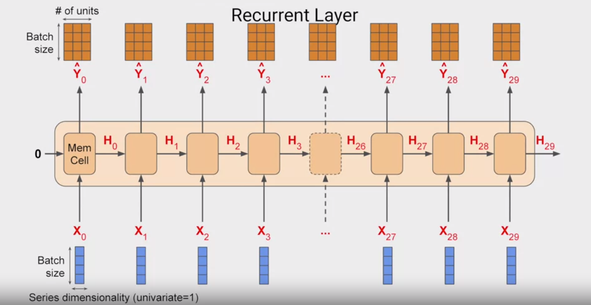

# TODO

<https://colab.research.google.com/github/https-deeplearning-ai/tensorflow-1-public/blob/master/C1/W4/ungraded_labs/C1_W4_Lab_3_compacted_images.ipynb#scrollTo=ClebU9NJg99G>

<https://keras.io/api/layers/preprocessing_layers/>

<https://www.kaggle.com/datasets/rmisra/news-headlines-dataset-for-sarcasm-detection>

## Certification

Machine Learning Engineer:

* TensorFlow Developer Certificate
* CompTIA Data+
* AWS Machine Learning Specialty
* Microsoft Certified: Azure AI Engineer Associate
* Google Cloud: Professional Machine Learning Engineer

# NOTE

## Lecture

### C2W2

#### learning object

* Build a multiclass classifier for the Sign Language MNIST dataset
* Learn how to properly set up the ImageDataGenerator parameters and the model definition functions for multiclass classification
* Understand the difference between using actual image files vs images encoded in other formats and how this changes the methods available when using ImageDataGenerator
* Code a helper function to parse a raw CSV file which contains the information of the pixel values for the images used

### C3W2

#### takeaways

You looked at taking your tokenized words and passing them to an Embedding layer.

* Embeddings map your vocabulary to vectors in higher-dimensional space.

* The semantics of the words were learned when those words were labeled with similar meanings. For example, when looking at movie reviews, those movies with positive sentiment had the dimensionality of their words ending up pointing a particular way, and those with negative sentiment pointing in a different direction. From these, the words in future reviews could have their direction established and your model can infer the sentiment from it.

* You then looked at subword tokenization and saw that not only do the meanings of the words matter but also the sequence in which they are found.

### C4W1

### C4W3

RNN

RNN return_deq=True

## summary

* exploring how to use them with large datasets=
* taking advantage of augmentation, dropout, regularization, and transfer learning
* and of course, looking at the coding considerations between binary or multi-class classification

## During Test

* sparse_categorical_crossentropy -> list of array with probability
* categorical_crossentropy -> one hot target

This is a compilation of resources appearing in the lecture videos, ungraded labs, and assignments.

Week 1:

Moore's Law
 (Wikipedia)

Spurious Correlations: Arcades vs Doctorates
 (Tyler Vigen)

Birth and Death Rate in Japan
 (Wikipedia)

Global Temperature and Carbon Dioxide
 (GlobalChange.gov)

Slope-Intercept Form
 (Wikipedia)

Tensorflow API
 (TF Documentation)

Numpy
 (Official Website)

Pyplot
 (Official Website)

Keras Metrics
 (Official Website)

Week 2:

tf.data API
 (TF Documentation)

tf.data.Dataset
 (TF Documentation)

Flatten a dataset of windows
 (TF Documentation)

LearningRateScheduler
 (TF Documentation)

Week 3:

Huber Loss
 (Wikipedia)

SimpleRNN
 (TF Documentation)

Lambda Layer
 (TF Documentation)

Activation Functions
 (Wikipedia)

LSTM
 (DeepLearning.AI)

LSTM Layer
 (TF Documentation)

Week 4:

Convolutional Neural Networks
 (DeepLearning.AI)

Mini-batch Gradient Descent
 (DeepLearning.AI)

Sunspots Dataset
 (Robert Valt)

Solar Conditions
 (Australian Bureau of Meteorology)

Daily Minimum Temperatures in Melbourne
 (hosted by Jason Brownlee, source: Australian Bureau of Meteorology)
