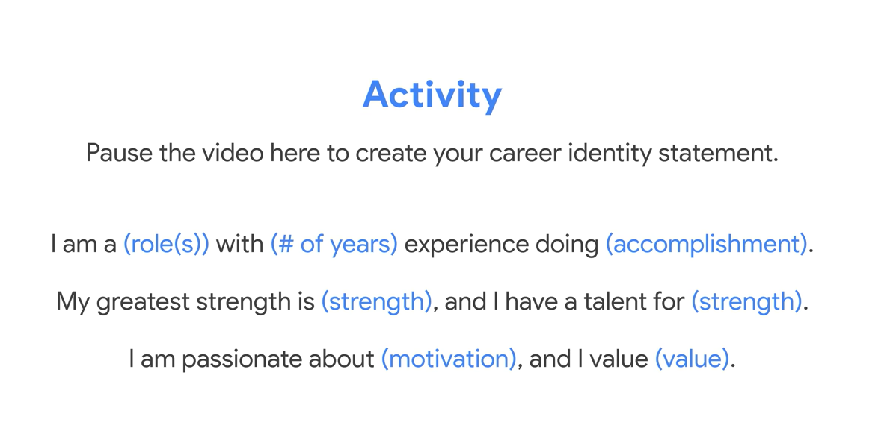

Google PMP Certification
=========================

* C1 Foundation of Project Management
* C2 Project Initiation: Starting a Successful Project
* C3 Project Planning: Putting it All Together
* C4 Project Ecxecution: Running the Project
* C5 Agile Project Management
* C6 Capstone: Applying Project Management in the Real World

Career Indentity


* Strength: 
      * 条理清晰：always
      * 能将复杂问题梳理清楚且讲清楚: always too, from ilm to mihoyo
      * 很强的执行力: as always (max值极高，续航能力相对弱)
      * 创造力，思维灵活的 problem solving ability： hand model training里，mocap里体现出很多
      * Great vision： 立刻转战warehouse
      * Inspirer： 团魂，因为我极度坦诚
      * 大E人： ENTJ
* Motivation:
      * 被看见，被认可，被尊重
      * 有挑战，有成就感： 我认为我是能力深不见底的人，亟待挖掘。而且面对挑战我很兴奋
* Values:
      * 真诚坦诚，找到手感，然后在事儿中悟道（就像在运动中悟道一样）


I am a 

# C1 Foundation of Project Management
## C1.M1: Embarking on a career in project management

Project manage > Program manage > Portfolio manage

* Program managers: Manage a group of projects that are related or similar to one another and handle the coordination of these projects. They facilitate effective communication between individual project managers and provide support where necessary. They also help create and manage long-term goals for their organization.

* Portfolio managers: Responsible for managing a group of related programs within the same organization. They coordinate various programs in order to ensure they are on track and that the organization is meeting its strategic initiatives. Portfolio managers look at all projects and programs within the organization and prioritize work as necessary. 

## C1.M2 Becoming an effective project manager

The value of PM:
* Proritization: identify the most important tasks and focus on them first
* Delegation: match tasks to those who can best complete the work
* Effective Communication


Project managers may be responsible for teaching and mentoring project team members, building relationships with the team and various stakeholders, controlling change and the impact to the project, empowering team members to make decisions, and communicating status and potential concerns. These interpersonal responsibilities can be just as important to the success of your projects as your more concrete responsibilities, like scheduling and budgeting.

As you continue through this course, you will learn more about how these project manager responsibilities are embedded into the different phases of a project


**Xhu note**

Recognize efforts is important.

"we learnt that we can learn and change our mind"

Core skill set as PM:


* Enabling decision-making
    * You can help team members feel empowered from the start of your project by making the decision-making process collaborative. For example, state the goals of specific deliverables and elicit input from your team on how to achieve those goals. You may have an idea of how you would like certain tasks to be accomplished, but your team members may have more creative or efficient approaches. Empowering your team to express their opinions and make their own decisions allows you to focus on the overarching management tasks and prioritize them in order of importance. Additionally, when you allow team members to have a voice in decisions, it helps foster an environment of responsibility, accountability, and team closeness.
* Communicating and escalating
    * Project management requires clearly communicating project goals and expectations, team member roles and responsibilities, and constructive feedback. Knowing how to effectively communicate and when to escalate issues to management is key to keeping you, your team, and your organization on the path to success. When escalation is required, try to approach management with both the problem and the potential solution or suggestions. This will show that you're taking initiative as a project manager.
* Strong organizational skills
    * Planning and scheduling software (templates, workflows, calendars)
    * Collaboration tools (email, collaboration software, dashboards)
    * Documentation (files, plans, spreadsheets)
    * Quality assurance tools (evaluations, productivity trackers, reports)
* Flexibility
    * All project managers need the ability to adapt and overcome changes and challenges. Let's further explore why flexibility is such a critical project management skill and discuss how it can help prepare your team for change, mitigate risks, and handle ambiguity. 
    * **Flexible planning**
        * Change is inevitable, and the more flexible you are as a project manager, the more successful you will be throughout your career. These flexible planning strategies can help you manage your project during times of unpredictability: 

        * Assess external constraints. When planning your project, take external events into account, such as national holidays and team member vacations and sick leave. Leaving extra time in the schedule for these inevitable events up front can help minimize the impact to your project.

        * Plan for risks and challenges. If you consider the risks that may occur, you may be able to find solutions for them in advance. For example, what if someone on your team gets sick or decides to quit? Are you able to replace them within the company? If not, can you hire an independent contractor? Come up with a list of people who may be able to join your team if one of your team members becomes unavailable. You can also assess risks by looking at historical data. Review your past projects and examine the challenges you faced. Then evaluate if similar challenges could occur in this project and prepare accordingly. We will discuss risk management at length later in this program.

        * Calculate “float” in your schedule. Float, or slack, refers to the amount of time you can wait to begin a task before it impacts the project schedule and threatens the project outcome. Identifying float in your schedule can help with resource management, scheduling, and keeping your project on track. You will learn more about calculating float in a later course, when we discuss creating a critical path for your project tasks.

* Handling ambiguity
Ambiguity can be a big challenge in managing projects. Project managers often face ambiguity in goals, requirements, schedules, vision, or other areas related to the project. Your team will look to you to lead during times of ambiguity and change, and flexibility is especially important during these instances. Here are some different ways to help your team deal with ambiguity:
    * Keep calm. In uncertain times, handling ambiguity with grace and poise will help inspire the members of your team to do the same. 

    * Express empathy. As a project manager, it is important to try to understand what your team is thinking and feeling, especially during times of ambiguity. Let your team members know that you care about the challenges they are facing and are there to support them.

    * Communicate what you know clearly. Define the aspects of the project that are confirmed and will not change. This helps your team get a better sense of what to expect, regardless of any aspects of the project that are still unknown or changing.

    * Make decisions and stick to them. Try not to second-guess your decisions in front of your team since this can lead to greater uncertainty. If you need to change course, clearly explain why you have chosen to do so to your team. 

    * Trust the expertise of your team. Increase clarity by having everyone on your team discuss what they already know or believe to be true about components of your project, such as what is involved in specific tasks or resources needed, based on their areas of expertise. Then, discuss what you still don't know and brainstorm ways to gather more information.


**Influence without authority**
* Interpersonal skills: 
    * Enabling decision making: The ability to enable decision making on the team, or gather decisions from the appropriate leader is crucial to keep projects on task and achieve their goals. As a project manager, you will need to enable decisions frequently. 

    * Communicating and escalating: As a project manager, you'll use your communication skills in just about everything you do. And you need to know when it is appropriate to escalate, so that critical issues are raised and addressed as soon as possible to reduce negative impact on a project.

    * Remaining flexible: As a project manager, knowing how to be flexible when changes are needed is key. Plans will change — even with careful, upfront planning. As a project manager being flexible is critical to be able to course correct and adapt when the unexpected happens. 

    * Organizational Skills: Having strong organizational skills means having the ability to organize the core elements of a project and ensure nothing gets lost or overlooked. A project manager needs to be organized so that they can manage a project and all of its moving parts.

    * Negotiation: As a project manager, you'll have to know how to balance the needs of your teammates with the needs of the project. For example, if a teammate says they can't complete their work on time, you may need to compromise on a deadline. 

    * Conflict mediation: Resolving tension and conflict within a team is an important skill. This may involve setting up a meeting with two teammates that are struggling to agree upon the best way to handle a shared task. 

    * Understanding motivations: Getting to know your teammates and figuring out what pushes them to their best work is an effective skill to have. 


## C1.M3 The project management life cycle and methodologies


### The project life cycle

**Initiate the project**
In this phase, ask questions to help set the foundation for the project, such as:

* Who are the stakeholders?

* What are the client's or customer's goals?

* What is the purpose and mission of the project?

* What are the measurable objectives for the team?

* What is the project trying to improve? 

* When does this project need to be completed? 

* What skills and resources will the project require? 

* What will the project cost? What are the benefits?

*Make a plan*
In this phase, make a plan to get your project from start to finish. 

* Create a detailed project plan. What are the major milestones? What tasks or deliverables make up each milestone?  

* Build out the schedule so you can properly manage the resources, budget, materials, and timeline. Here, you will create an itemized budget.

*Execute the project*
In this phase, put all of your hard work from the first two phases into action. 

* Monitor your project team as they complete project tasks. 

* Break down any barriers that would slow or stop the team from completing tasks. 

* Help keep the team aware of schedule and deliverable expectations.

* Address weaknesses in your process or examine places where your team may need additional training to meet the project's goals.

* Adapt to changes in the project as they arise.

**Close the project**
In this phase, close out the project.

* Identify that your team has completed all of the requested outcomes. 

* Release your team so they can support other projects within the company.

* Take time with your team to celebrate your successes! 

* Pass off all remaining deliverables and get stakeholder approval.

* Document the lessons you and your team learned during the project.

* Reflect on ways to improve in the future.

### Waterfall and Agile methodologies

| **Aspect**          | **Waterfall**                                                                                                                                 | **Agile**                                                                                                                                                              |
|---------------------|----------------------------------------------------------------------------------------------------------------------------------------------|------------------------------------------------------------------------------------------------------------------------------------------------------------------------|
| **Project manager's role** | Project manager serves as an active leader by prioritizing and assigning tasks to team members.                                           | Scrum Master acts primarily as a facilitator, removing any barriers the team faces. Team shares more responsibility in managing their own work.                        |
| **Scope**           | Project deliverables and plans are well-established and documented in the early stages of initiating and planning.                             | Planning happens in shorter iterations and focuses on delivering value quickly. Subsequent iterations are adjusted in response to feedback or unforeseen issues.       |
| **Schedule**        | Follows a mostly linear path through the initiating, planning, executing, and closing phases of the project.                                   | Time is organized into phases called Sprints. Each Sprint has a defined duration, with a set list of deliverables planned at the start of the Sprint.                 |
| **Cost**            | Costs are kept under control by careful estimation up front and close monitoring throughout the life cycle of the project.                    | Costs and schedule could change with each iteration.                                                                                                                   |
| **Quality**         | Project manager makes plans and clearly defines criteria to measure quality at the beginning of the project.                                  | Team solicits ongoing stakeholder input and user feedback by testing products in the field and regularly implementing improvements.                                     |
| **Communication**   | Project manager continually communicates progress toward milestones and other key indicators to stakeholders, ensuring that the project is on track to meet the customer's expectations. | Team is customer-focused, with consistent communication between users and the project team.                                                                            |
| **Stakeholders**    | Project manager continually manages and monitors stakeholder engagement to ensure the project is on track.                                    | Team frequently provides deliverables to stakeholders throughout the project. Progress toward milestones is dependent upon stakeholder feedback.                       |

### Lean and Six Sigma methodologies
#### Lean
Lean methodology is often referred to as Lean Manufacturing because it originated in the manufacturing world. The main principle in Lean methodology is the removal of waste within an operation. By optimizing process steps and eliminating waste, only value is added at each phase of production.  

Today, the Lean Manufacturing methodology recognizes eight types of waste within an operation: defects, excess processing, overproduction, waiting, inventory, transportation, motion, and non-utilized talent. In the manufacturing industry, these types of waste are often attributed to issues such as: 

* Lack of proper documentation
* Lack of process standards
* Not understanding the customers' needs
* Lack of effective communication
* Lack of process control
* Inefficient process design
* Failures of management

Lean 5S quality tool
1. Sort: Remove all items not needed for current production operations and leave only the bare essentials. 
2. Set in order: Arrange needed items so that they are easy to use. Label items so that anyone can find them or put them away. 
3. Shine: Keep everything in the correct place. Clean your workspace every day.
4. Standardize: Perform the process in the same way every time. 
5. Sustain: Make a habit of maintaining correct procedures and instill this discipline in your team.

#### Six Sigma

Six Sigma is a methodology used to reduce variations by ensuring that quality processes are followed every time. The term “Six Sigma” originates from statistics and generally means that items or processes should have 99.9996% quality.

**Popular project management approaches:**
Waterfall, Agile,Scrum,Kanban, Lean, Six Sigma

## C1.M4 Understanding organizational strucutre

* Organizational structure refers to how the company is organized, who does what, and who reports to whom. Understanding this structure can help you figure out where you fit in

Two popular strucutures
* Classic strucuture: traditional top-down system of reporting

* Matrix structure: Direct higher-ups and stakeholders from other depoartments or programs


In both Classic and Matrix organizations, project managers must clearly define roles and responsibilities in order to work effectively. However, within most Matrix organizations, some project managers or department leads may have the same level of authority as the functional managers and operate more directly.

Functions of PMO (Project Management Office)

* Strategic planning and governance
* Best practices
* Common project culture 
* Resource management
* Creation of project documentation, archives, and tools

# C2 Project Initiations: Starting a Successful Project

## C2.M1: Initiating a project

**Cost Benefit Analysis (CBA)**:
Adding up the expected valud of a project(the benefit) and comparing them to the dollar costs

**Key components of initiating a project**:
* Goals: what you've been asked to do and what you're trying to achieve
* Scope: the process to define the work that needs to happen to complete the project
* Deliverables: products and services that you will create for your customer, client, or project sponsor
* Success criteria: the standards bu which you measure how successful a project was in reaching its goals
* Stakeholders: people who both have an insterest in, and are affected by, the completion and success of the project
* Resources: budgets, people, materials, and equipment that you will need to complete the project


## C2.M2 Introduction: Defining project goals, scope, and success criteria

### Defining project goals

SMART Goals and OKR

**SMART Goals**:

Specific: The objective has no ambiguity for the project team to misinterpret. 

Measurable: Metrics help the project team determine when the objective is met.

Attainable: The project team agrees the objective is realistic.

Relevant: The goal fits the organization's strategic plan and supports the project charter.

Time-bound: The project team documents a date to achieve the goal.

### Identifying project scope

**Scope and Scope creep**

**Triple constraint**
* Time: The project must be completed by a certain date.
* Cost: The project must be completed within a certain budget.
* Scope: The project must meet the goals and objectives set forth in the project charter.


### Measuring project success
Launch: delivering the final result of your project to the client or user
Landing: meeting the **success criteria** you establish at the beginning of the project

Launch first, land later

**Success criteria**
Adoption metrics might include launching a new product to a group of users and having a high amount of them use or adopt it
Engagement metrics might include increasing the daily usage of a design feature or increasing orders and customer interactions. 

## C2.M3 Working effectively with stakeholders
### Stakehoder analyse

Quadrant 1: High Influence, High Interest (Upper Right)

Stakeholders in this quadrant have a significant influence on the project and are highly interested in its outcome. They can greatly impact project decisions and success. Examples might include project sponsors, key executives, or regulatory authorities. Responses for this quadrant include:

Engagement and Involvement:

Keep these stakeholders well-informed and engaged throughout the project lifecycle.

Involve them in decision-making processes, seeking their input and feedback.

Address their concerns promptly and effectively.

Regular Communication:

Schedule regular meetings or updates to keep them informed about project progress and any issues.

Tailor communication to their preferences and needs to ensure they remain supportive and engaged.

Quadrant 2: High Influence, Low Interest (Upper Left) 

Stakeholders in this quadrant have high influence but may not be deeply interested in the day-to-day project details. They might include senior managers who need to be informed but may not be actively engaged. Responses for this quadrant include:

Executive Summaries:

Provide high-level summaries of project progress and key decisions for their review.

Focus on the impact of the project on organizational goals and objectives.

Periodic Updates:

Provide periodic briefings or updates to ensure they are informed of major milestones and critical project changes.

Quadrant 3: Low Influence, High Interest (Bottom Right) 

Stakeholders in this quadrant have a high interest in the project but relatively low influence on its outcome. They are typically looking for updates and information about the project. Responses for this quadrant include:

Regular Updates:

Communicate project progress, risks, and updates to keep them engaged and informed.

Address their queries and concerns promptly to maintain their interest.

Stakeholder Feedback:

Seek their feedback on project plans, progress, and outcomes to ensure their perspective is considered.

Quadrant 4: Low Influence, Low Interest (Bottom Left)

Stakeholders in this quadrant have low influence on the project and limited interest in its details. They might include lower-level employees or departments not directly impacted by the project. Responses for this quadrant include:

General Communication:

Share general updates about the project's overall progress without overwhelming them with details.

Address any specific questions they may have, but avoid unnecessary inundation with project-related information.

Minimal Engagement:

Maintain a basic level of communication and engagement to keep them aware of the project without distracting them from their regular responsibilities.


Suggested questions for stakeholders
* What are your most important priorities/goals?
* How will this initiative/project support you and your most important priorities?
* What role would you like to play within this initiative/project?
* Here's how I plan to keep people informed; does that work for you?
* What can I clarify for you?
* What are your expectations? What would you like for the project to accomplish?
* What would success look like for you?
* Who else do you recommend I reach out to about this initiative?
* What information or insights do you have that might be challenging for me to find?
* Where do you see me getting support for this initiative? Facing resistance?
* What additional thoughts/questions do you have?

### RACI chart

R: Responsible: who gets the work done
A: Accountable: who makes sure the work is done
C: Consulted: who gives input or feedback on work
I: Informed: who needs to know the outcome


## C2.M4 Project Initiation: Starting a Successful Project

### Understanding project resource needs

* Budget
* People
* Materials

### Developing documentation for project kick-off

Clear and consistent documentation can ensure transparency and clear communication.

* Project proposal
* Project charter

Project charters will vary but usually include some combination of the following key information:
1. Executive summary:  outlines the project's purpose and desired outcomes.
2. Project goals: should be SMART and well-defined.
3. Deliverables: include expected outcomes, both tangible and intangible
4. Business case:  explains the reason for the project and how it supports the company's overall success.
5. Benefits and costs: describe what the company hopes to get out of the project, as well as the money and resources it requires.
6. Scope and exclusion: defines activities that are part of the project—and those that are not.
7. Project team
8. Measuring success: lists the success criteria that help you determine when the project has reached its goal.


### Tools

* scheduling tool , e.g. Microsoft Project, Smartsheet, Trello, Asana
* productivity tools, e.g. Google Docs, Microsoft Office, Spreadsheet, and PowerPoint
* collaboration tools, e.g. email and chat
* project management software, e.g. Asana, Trello, Jira, Microsoft Project, Smartsheet

[Project Timeline](https://docs.google.com/spreadsheets/d/1Us-j-BAG3kiIJENBt3SqRXkJQL_TZh-yejJyZzq9L60/template/preview#gid=1709744959)
[Project Tracking](https://docs.google.com/spreadsheets/d/12AK5slxygSxj8nmjS39SCnEFkCy8WZDbgN0vSQh2xwg/template/preview?resourcekey=0-__sqaWcGZavYWgXz-WD4jQ#gid=1161341563)
[Gantt Chart](https://docs.google.com/spreadsheets/d/1Yc1KA_7DMwBqyt2Zcx68HAV3oEp1FnUt-undm0XHgqM/template/preview?resourcekey=0-y-3VgQEbmAVaiEGfeyeJ-g#gid=1115838130)
[Event Marketing Timeline](https://docs.google.com/spreadsheets/d/10GindXMsW6z0pFvd5Ymjz_PS0dXJ5eCkl3KDKEPO9qY/template/preview#gid=541890420)

**Xhu note**
感觉PM是 "中心"， entj的特质很适合这个角色 

# C3 Project Planning: Putting it All Together
## C3.M1 The benefits of project planning
### Planning phase components

Project plan three major project components:
* Schedule
* Budget
* Risk management

Project Kickoff Meeting
* to align on the scope
* to build team rapport
* to establish a shared vision
* to set expectations

```markdown
Kickoff meeting agenda
* Introduction
    * project team and stakeholders.
* Project background
* Goals and scope
    * In-scope
    * Out-of-scope
    * Target launch date
    * Milestones
* Roles  
* Collaboration
    * Shared project tools and documents
    * Communication expectations
* What comes next
* Questions
    * Gain clarity on meeting topics
    * Ensure the project benefits from diversity of thoughts experiences and ideas
```


Milestones and Tasks
* A project task is an activity that needs to be accomplished within a set period of time and is assigned to one or more individuals for completion. The work of a project is broken down into many different project tasks. 

* A project milestone is an important point within the project schedule that usually signifies the completion of a major deliverable. Milestones are significant checkpoints in your project, and keeping track of them helps ensure that your project is on schedule to meet its goals.

Milestones
* help give you a clear picture of the amount of work required
* help your project stay on track
* uncover areas where you might need additional resources
* motivate your teammates
* show progress to your stakeholders

How to set: by looking at your project as a whole and pulling out important checkpoints that show progress, assign deadlines to each milestone while keeping the needs of your stakeholders top of mind

work breakdown structure (WBS)


## C3.M2 Building a project plan
### Project plan components

* Scope and goals
    * will be captured initially in project charter, the document that clearly defines the key details of the project
    * RACI chart will help define roles and responsibilities too
* Work Breakdown Structure
    * sort milestones and tasks in a hierarchy
* Budget
* Management plans
    * change management plan
    * risk management plan
    * communication plan

### Estimate
Time estimate and Effort estimate
Avoiding plammomh fallacy

Soft skills
* Asking the right questions
* Negotiating effectively
* Practing empathy

Critical path
* defination: refers to the list of required project milestones must reach to complete the project schedule
* How to create
    * Step 1: Capture all tasks
    * Step 2: Set dependencies
    * Step 3: Create a network diagram
    * Step 4: Make time estimates
    * Step 5: Find the critical path 
        * forward pass: start from first task and add up duration
        * backward pass: start with final task and move backwards through schedule
        * calculate earliest and latest start dats and slack


### Utilizing tools to build a project plan
Gantt Chart


## C3.M3 Understanding Project budgets


### Budgeting
Budgets are typically created in the initiation and planning phases of your project.

A baseline budget is an estimate of project costs that you start with at the beginning of your project.

Key components
* Resource cost rate: some examples of resources are labor, tools, equipment, materials, and software.
* Reserve analysis: a method to check for remaining project resources thus determine if need to add buffer funds, aka contigency costs
* Contigency budget: money that is included to cover potentially unforeseen events that aren't accounted for a coast est
* Cost of quality: all of the costs that are incurred to prevent issues with products, processes, or tasks. 
    * prevention costs
    * appraisal costs
    * internal failure costs
    * external failure costs

Best practices
* Reference historical data
* Utilize your team, mentors, or manager
* Time-phase your budget
* Check, check, and double check

Categorize different types of costs
* Direct costs
    * Wages and salaries of employees and contractors 
    * Materials costs
    * Equipment rental costs
    * Software licenses 
    * Project-related travel and transportation costs
    * Staff training
* Indirect costs
    * Administrative costs
    * Utilities
    * Insurance 
    * General office equipment 
    * Security
 
Budgeting terms
* Cash flow
* Capital expense (CAPEX): an organization's major, long-term, upfront expenses, such as buildings, equipment, and vehicles. They are generally for assets that the company will own and keep. The company incurs these expenses because they believe they will create a benefit for the company in the future. 
* Operating expenses (OPEX): the short-term expenses that are required for the day-to-day tasks involved in running the company, such as wages, rent, and utilities. They are often recurring. 
* Contingency reserves: an estimated amount that are used to cover the costs of identified risks
* Management reserves: percentage of the total cost of the project that are used to cover the costs of unidentified risks

Challenges
1. Budget pre-allocation: budget is already set before you even start the project > work with your customer to set expectations on scope and deliverables
    * Fixed contracts: usually paid for when certain milestones are reached
    * Time and materials contracts: usually paid for monthly, based on the hours worked and other fees associated with the work, such as travel and meal expenses. 
2. Inaccurately calculating TCO: Additional types of costs of ownership need to be considered
3. Scope creep: when changes, growth, and other factors affect the project's scope at any point after the project begins
    * A vague Statement of Work (SoW)
    * Conversations and agreements about the project that aren't officially documented
    * Unattainable timeframes and deadlines
    * Last-minute asks from priority stakeholders

### Procurement
obtaining all of the materials, services, and supplies required to complete the project
1. Initiating: planning what you need to meet your project goal
2. Selecting: deciding which suppliers and vendors to use
3. Contract writing: developing, reviewing, and signing contracts
4. Controlling: making payments and maintaining and ensuring quality
5. Completing: measuring your success

Procurement management process
* Agile: often more collaborative with both the project team and the end supplier than traditional approaches
* Traditional: features lengthy and extensive documentation with fixed requirements that are difficult to negotiate
 
Common procurement documentation
* NDA: Non-disclosure Agreement
* RFP: Request for Proposal
* SoW: Statement of Work

SME: Subject matter export

Ethical Trap
* Corruption and bribery
* Sole-supplier sourcing: other vnedors aren't even allowed to biding for contracts
* Interactions with state-owned entities

Avoid ethical traps
* Understand the legal requirements for your procurements
* Stick to your ethical codes

## C3.M4 Managing risks effectively
### Defination and identification
Risk: A potential event whoch can occur and can impact your projects
Issue: A known or real problem that can affect the ability to complete a task

Risk are the whatifs, issue is that happened
Risk management is the process of identifying and evaluating potential risks and issues that could impact a project.

Rrisk management provide an understanding of:
* What could go wrong with the project
* Who to consult about risks
* How project risks could be mitigated

Phase of rsik management
1. Identify the risk. The first phase of the risk management process is to identify and define potential project risks with your team. After all, you can only manage risks if you know what they are. 
2. Analyze the risk. After identifying the risks, determine their likelihood and potential impact to your project. Serious risks with a high probability of occurring pose the greatest threat.
3. Evaluate the risk. Next, use the results of your risk analysis to determine which risks to prioritize.
4. Treat the risk. During this phase, make a plan for how to treat and manage each risk. You might choose to ignore minor risks, but serious risks need detailed mitigation plans.
5. Monitor and control the risk. Finally, assign team members to monitor, track, and mitigate risks if the need arises.

**An opportunity is a potential positive outcome of a risk**

Tools to help identify risks:
* Risk register
* Risk assesment
* Probability and impact matrix
* Cause-and-effect diagrams, fishbone diagram
* Inherent risk
* Risk appetite: the willingness of an organization to accept the possible outcomes of a risk

Type of risks
* Common types
    * Time risk
    * Budget risk
    * Scope risk
* External risk: referring to risks that result from factors outside of the company that you have little to no control over
* A single point of failure: a risk that has the potential to be catastrophic and halt work across a project
* Dependency
    * Internal dependencies: within/can be control inside project
    * External dependencies

### Mitigating and communicating risks

Common ways to deal with risk
* Avoid
* Accept
* Reduce or control
* Transfer

Decision tree


## C3.M5 Communication and Documentaiton
### Communication
Creating an effective communication plan
Tips for effective communication
* Recognize and understand individual differences
* Brainstorm and craft the appropriate message
* Deliver your message
* Obtain feedback and incorporate that feedback going forward

Communication plan needs to address these questions: 
1. what needs to be communicated
2. who needs to communicate
3. when communication needs to happen
4. why and how to communicate
5. where the information communicated is stored

Communication plan
* Project stake holders
* Communication frequency and method
* Goals
* Barriers

Effective communication is clear, honest, relevant, and frequent
### Documentation
1. Visibility, Accountability and Continuity
2. Need-to-know bais

| Key Docs             | Description                                                                                               |
|----------------------|-----------------------------------------------------------------------------------------------------------|
| Project charter      | An overview of the project, key elements and expectations                                                 |
| Statement of work    | Identifies the work that is included in the project and the pricing that was quoted initially.            |
| Risk management plan | Identifies the potential risks to the project, their likelihood, and how you plan to mitigate them.       |
| Schedule             | Identifies the planned schedule as well as any changes throughout the project lifecycle.                  |
| Budget               | Identifies the planned budget as well as any over and under runs. Allows you to estimate the cost at completion. |
| Communication plan   | Identifies how often, what type of communication method, and what information your stakeholders need to know |
| Shared folder        | Folder with all relevant documentation                                                                    |
| RACI chart           | Identifies who is responsible, accountable, consulted, and informed within the project.                  |

Core skills
* Enabling decision-making
* Communicating effectively
* Flexibility
* Strong organizational skills
* Managing tasks effectively
* Working well with others
* Following through on tasks
* Holding teammates accountable

# C4 Project Ecxecution: Runing the Project
## C4.M1 Tracking and measuuring project progress
### C4.M1 Tracking and measuring project progress

Tracking is important for a few key reasons
* transparency
* risk management
* keeping the project on track

Commonly trackig items
* Project schedule
* Status of action items, key tasks and activities
* Progress toward milestones
* Costs
* Key decisions, changes, dependencis and risks to the project

Tracking method
* Gantt chart (usually for waterfall project)
    * Helping a team stay on schedule
    * Projects with lots of tasks, dependencies, and milestones
    * Projects with large teams, because ownership and responsibilities are explicitly laid out visually

* Roadmap
    * High-level tracking of large milestones. Roadmaps outline the project as a whole and provide an overall snapshot of key points—just like an actual roadmap contains points of interest and mile markers. 
    * Illustrating to your team or key stakeholders how a project should evolve over time
    
* Burndown chart
    * Projects that require a detailed review of tasks, broken-down review of each task associated with a project
    * Projects where finishing on time is the top priority

Project status reports Components:
* Project name
* Date
* Summary: goals, schedule, highlights, and lowlights in one central place for easy stakeholder visibility
* Status: RAG (red, amber, green) -> Overall Status
* Milestones and tasks
* Issue

Dependencies
* External dependency
* Internal dependency
* Discretionary dependency
* Mandatory dependency

Risk exposure helps to measure potential future loss. One way to calculate risk exposure is to build a matrix with two variables: risk impact and probability. 

ROAM analysis
* Resolved -- consider this risj to be addressed. It's no longer a problem
* Owned -- Assign a team member ownership of the risk and monitor the risk through to completion
* Accepted -- Understand and accept the risj for what it is because it can't be resolved
* Mitigated -- Formulate a plan to eradicate the risk

Escalaton
* Act as checks and balances
* Generate speedy decision making
* reduce frustrations
* Encourage participation

Project managers should escalate issues at the first sign of critical problems.

A retrospective focuses on identifying the contributing causes of an incident or pattern of incidents without blaming one individual

Effective escalation emails 5 keys:
* Maintain a friendly tone
* State your connection to the project
* Explain the problem
* Explain the consequences
* Make a request

Steps:
1. Write a subject line
2. Write a greeting (keeping a friendly tone)
3. State your connection to the project
4. Explain the problem
5. Explain the consequences of the issue
6. Propose a course of action and make a request
 
```text
Alternate text of email:

To: knelson@graciousgiftbaskets.com, gabrielmendoza@graciousgiftbaskets.com [Your stakeholders]

Subject: [Action required]  Decision needed to make progress on Holiday Scents project

Hi Karen and Gabriel,

[Keep it friendly and state your connection to the project]
I hope you are doing well. As you may know, I have been managing our Holiday Scents product line, which is scheduled to launch in October. 

[Explain the problem]
I would like to bring an issue to your attention. The baskets in this product line will include scented candles, and we placed an order with Candlemakers, Inc. for 5,000 candles to be delivered to the warehouse by Friday to prepare for our first customer shipment. To date, we have received 3,000 of the 5,000 candles. Unfortunately, many of the candles we have received so far fail to meet our quality standards. The packaging is damaged, or the candles themselves are broken. 

[Explain the consequences]
This puts our customer satisfaction rates at risk. Failure to meet the quality requirements for the candles by Friday will result in postponing the product launch by three weeks. If this delay occurs, we will incur an additional cost of $20,000 because we will need to order a new shipment of candles and review the quality standards of each to ensure that they meet our contractual agreements. 

[Propose a course of action and make a request]
I have sourced two backup suppliers that have five-star reviews and a track record of on-time deliveries. I propose we meet with them both right away so we can onboard one of them quickly. That way, we can avoid major delays. Are you available for a meeting tomorrow to discuss options and come to an agreement on next steps? Please respond with the times that work best for you. 

Thank you in advance for your consideration and insight,

Sayid
```

Trech war v.s. Bad compromise

Trech war v.s. Bad compromise

## C4.M2 Quality management and continuous imporvement
### Quality management
Quality management concept: provide requirements, specifications, or guidelines that can be used to ensure that products, processes, or services are fit for achieving the desired outcome
* Quality standards:
    * Reliability Standards
    * Usibility Standards
    * Product Standards
* Quality planning:  involves the actions of you or your team to establish and conduct a process for identifying and determining exactly which standards of quality are relevant to the project as a whole and how to satisfy them
* Quality assurance:  spans the project life cycle, monitoring the project to confirm it will deliver a high-quality service or product
* Quality control: involves monitoring project results and delivery to determine if they are meeting desired results

**XHU notes**
Quality standards -> what
Quality planning -> how
Quality assurance -> continuous monitoring
Quality control -> final check

Foster customer relationships with communication skills
* Negotiation
* Empathetic listening
* Trust building

**XHU notes**
* Ask open-ended questions
* Setting communication expectations

Measuring customer satisfaction
* Feedback surveys
* User acceptance tests (UAT) , aka.beta test


### Continuous imporvement v.s. process improvement
Process improvement: the practice of identifying, analyzing, and improving existing processes to enhance team performance, meet best practices, or optimize consumer experiences
Continuous improvement: an ongoing effort to improve products or services. It begins with recognizing when processes and tasks need to be created, eliminated, or improved. 

Continuous improvement
* Happen when processes and tasks need to be:
    * created/eliminated/imporved
* Data-driven imporvement frameworks
    * DMAIC: 
        * Define: define the business problem, goals, resources, project scope, and project timeline
        * Measure: conduct performance metrics and data collection to establish baselines and measure success
        * Analyze: find the root causes of problems and understand their impact
        * Improve: implement a reasonable solution to the problem
        * Control: implement the changes and stay on top of monitoring the updated processes you've established
    * PDCA: Plan, Do(fix the problem), Check, Act (fine-tune the solution)

Scale: Project < Program < Portfolio

### Retrospecctive

Main purpose:
* Facilitate imporved collaboration on future projects
* Encourage team building
* Promote prositive changes in future procedures and processes

Best practices:
* ensure discussion is balemless
* reflect on positive aspects of the project as well as the negatives
* switching from 'you' to 'we'

Typical reasons for holding a retrospective
* Delivering a new product
* Missed deadlines or expectation
* Miscommunication between stakeholders
* Kickoff of a new project
* Reached the end of a Sprint 

The Steps of a retrospective:
1. Project summary
    * Goals and objectives
    * Duration
    * Team members
    * Methodology
    includes links to key documents including the project charter, production plan, and scene requirements
2. Key accomplishments
    * begin the meeting on a positive note by encouraging the team to list out what went well
3. Lessons learned
    * discusses things that need improvement
    * instances when they were fortunate that things went in their favor
4. Action items
    * turn lessons into action items
5. Future considerations
    * discuss what the team would do differently for similar projects in the future
6. Resources and notes
    * include links to any relevant documents which the team said they found valuable as retrospective will serve as a reference

## C4.M3 Data-driven decision-making

Benefits of using data in project management
* Understand performance
* Solve problems
* Make better decisions
* Improve processes

Types of data
Metrics: quantifiable measures that track the progress of a project
* Productivity metrics
    * Milestones
    * Tasks 
    * Projections
    * Durations
* Quality metrics
    * Number of changes
    * Issues
    * Cost variance

Data ethics v.s. Data privacy v.s. Data bias

* Quantitative data: statistical and numberical facts
* Qualitative data: subjective qualities that can't be measured with numerical data

Data analysis: ask > prepare > process > analyze > share > act
* ask:
    * ask key questions to frame the analysis (Whxx), be as specific as possible
    * identify stakeholders and understading the expectations
* prepare: collect and store the data 
* process: clean and organize the data
* analyze: close look to draw conclusions, transform and organize the data in a way that highlights the full scope of the results 
* share: data visualize
* act: make decisions based on the data and put into action

### Presenting data
Presentation steps
1. Define the audience: find what matters most to them
 * What would my audience want to know about the project? 
 * what are their most urgent concerns? 
 * Which key data points influence the story and project outcome? 
2. Find the data
3. Filter and analyze the data
4. Choose a visualization (essential part of data presentation)
5. Shape the story: consider what you want to achieve, the points you want to make, and the questions you want to address
6. Gather feedback

### Visualzation
* Dashboard
    * KPIs
* Burndown Chart
* Column Chart / Pie chart

Steps:
1. Visualizing your data
2. Show relationships
3. Comparing values
4. Analyzing trends and behaviors  

Infographics: visual representation of information, data, or knowledge intended to present information quickly and clearly

Giving effective presentation
* Be precise
* Be flexible
    * Consider the approach you'd take if need to give shorter presentation
    * Practice to avoid mistakes
    * Identify and comp up with answers to potential audience
    * Imagine and prepare for possible objections

* Be memorable
    * Use stories or repetition to help your audience remember information
    * Beware of your body language
        * Posture
        * Tone of voice
        * PAce
        * Eye contact
        * Warm and friendly facial expressions
        * Confidence

Techniques for effective presentation:
1. Create clear simple slides
2. Add alt text for images, drawings or diagrams
3. Use text or critical information
4. Provide captions for all audio or video recordings
5. For contrast and text size, more is better
6. Share content in advance

**XHU notes**
A clear representation relies on the fact that the presenter really think it through and undestand the situation.

## C4.M4 Leadership
### Leadership
Five factos that impact team effectiveness
1 .Psychological safety
2. Dependability
3. Structure and clarity
4. Meaning
5. Impact

**XHU notes**
Be direct and kind. my spirit might really is learning from ilm 0 0

# C5 Agile Project Management
## C5.M1 Fundamentals of Agile


Agile Manifesto: An iterative, flexible process that incorporates necessary changes throughout the process and is based on foundational values and principles

Agile and Waterfall
* Waterfall: A strict linear approch
* Agile: Iterative and flexible

### Agile Manifesto

4 Core Values of Agile Manifesto
* Individuals and interactions over processes and tools
* Working software over comprehensive documentation
* Customer collaboration over contract negotiation
* Responding to change over following a plan

12 Principles of Agile Manifesto
* Value Delivery: Delivering the work as quickly as possible in order to get feedback and mitigate time risks
    * Our highest priority is to satisfy the customer through early and continuous delivery of valuable software.
    * Deliver working solution frequently, from a couple of weeks to a couple of months, with a preference to the shorter timescale.
    * Simplicity—the art of maximizing the amount of work not done—is essential.
    * Continuous attention to technical excellence and good design enhances agility.
    * Working software is the primary measure of progress.

* Business Collaboration: collabration with your customers helps the team get critical business information immediately allowing them to adjust and adapt to the customer's needs
    * Business people and developers must work together daily throughout the project.
    * Welcome changing requirements, even late in development. Agile processes harness change for the customer's competitive advantage.

* Team Dynamics and Culsture: effective team culture, inclusive, supportive and empowering
    * Build projects around motivated individuals. Give them the environment and support they need, and trust them to get the job done.
    * The most efficient and effective method of conveying information to and within a development team is face-to-face conversation.
    * Agile processes promote sustainable development. The sponsors, developers, and users should be able to maintain a constant pace indefinitely.
    * The best architectures, requirements, and designs emerge from self-organizing teams.

* Retrospectives and Continuous Learning:
    * At regular intervals, the team reflects on how to become more effective, then tunes and adjusts its behavior accordingly.

VUCA
* Volatility
* Uncertainty
* Complexity
* Ambiguity

## C5.M2 Scrum 101
### Popular Agile Frameworks
* Kanban
    * Flow
* Extreme Programming (XP)
    * Innocative Practices
        * Pair Programming
        * Continuous integration and continuous refactoring
        * Avoid Big Design Up Front
        * Write tests, not requirements
* Lean
    * 5 Principles
        * Define value
        * Map value stream
        * Create flow
        * Establish pull
        * Pursue perfection
* Scrum: 
    * A freamework for develoiing, delivering, and sustaining complex products

### Scrum 101
* Product Backlog
    * The central artifact of Scrum
    * Product features
    * Prodict requirements
    * Activities associated with the product deliverables
* Traits
    * Iterative
    * Incremental
    * Empiricism: the idea that true knowledge comes from actual lived experience
* Three Scrum Pillars
    * Transparency
    * Inspection
    * Adaptation
* Five Scrum Values
    * Commitment
    * Courage
    * Focus
    * Openness
    * Respect
* Roles
    * Scrum Master: *Build the things fast*
        * primary responsibility is to act as a facilitator and coach to the Scrum Team
        * skills:
            * organization
            * leadership
            * facilitation
            * coaching
            * stakeholder management
    * Product Owner: *Build the right things*
        * primary responsibility is to represent the voice of the customer
        * is:
            * customer focus
            * decisive
            * flexible
            * optimistic and positive
            * available
            * collaborative
    * Development Team: *Build things right*
        * primary responsibility is to build the product
        * team size range from 3-9
        * is:
            * cross-functional
            * self-organizing
            * supportive
            * customer-oriented
* Scrum treams are 
    * cross-functional
    * self-organizing

Ref: [Characteristics of a Great Scrum Team](https://www.infoq.com/articles/great-scrum-team/)

## C5.M3 Impletmenting Scrum
### Product Backlog
* 3 key features
    * living artifact
    * owned and adjusted by the Product Owner
    * prioritized list of features

Ref: [2020 Scrum Guide](https://scrumguides.org/scrum-guide.html#product-backlog)

### User Stories
User stories help the team create a solution that's always centered around the user and the user experience.

* User
* Action
* Benefit

*As a [user role] I want this [action] so that I can get this [benefit]*

User story criteria: I.N.V.E.S.T. 
* Independent: The story's completion is not dependent on another story
* Negotiable: There is room for discussion about this item
* Valuable: Completing the user story has to deliver value
* Estimable: The Definition of Done must be clear so that the team can give each user story an estimate
* Small: Each user story needs to be able to fit within a planned Sprint
* Testable: A test can be conducted to check that it meets the criteria

Epics: a group of user stories.The purpose is to help manage related user stories. 
Acceptance Criteria: a set of conditions that must be met in order for the user story to be considered complete

Rrelative estimation
* T-shirt sizing: a way to estimate the size of a user story.
    * XS, S, M, L, XL
* Story points: a way to estimate the effort required to complete a user story
    * Fibonacci sequence: (0, 1), 1, 2, 3, 5, 8, 13, 21, 34

### Scrum events
* The Sprints
    * Time-boxes: 1-4 weeks
    * How much overhead—such as testing and review—goes into the delivery of the product
    * The expected frequency of changes
    * How much focused time the solution Developers need to build a Backlog item
* Sprint Planning
    * Definition of Done: a list of criteria that must be met in order for a user story to be considered complete
    * Sprint Backlog
* Daily Scrum
    * standsup. synchronize activities and create a plan for the next 24 hours
    * 3 questions
        * What did you do yesterday?
        * What will you do today?
        * Are there any blockers?
* Sprint Review
    * meeting with the entire scrum team where the product is demostrated in order to determine which aspects are finished and which are not
    * Product Increment: what is produced after a given Sprint and is considered releasable
* Sprint Retrospective
    * meeting with the entire Scrum Team to discuss what went well, what didn't, and what can be improved, up to 3 hours
    * 3 questions
        * What went well and what are not?
        * What imporvement are worth trying in the next Sprint?
        * What imporvement were put in place for the last Sprint? Were they helpful or not? Why?
    * Structure
        * A subject line
        * An intro
        * A recap of the Sprint Retrospective
        * 5-10 key takeaways based on the discussion notes
        * Next steps
        * A closing

Releasable Product Increment to Minimum Viable Product (MVP)

### Scrum tools
* Velocity v.s. Burndown chart
    * Velocity: the amount of work a team can complete in a Sprint
* Kanban board
    * WIP limits

Transparency abd collaboration
* Jira
* Trello
* Asana

[Link](https://www.youtube.com/watch?v=502ILHjX9EE)

## C5.M4 Applying Agile in the organization
* Build the right thing
* Build the thing right
* Run it right

value means different things to different people

Value roadmap


Value roadmap 3 key components
* Product Vison
* Product Roadmap
* Release Plan
    * Release goal
    * List of backlog items
    * Estimated realase date
    * Other relevant dates that impact a release


The best way to think about changing your plan is to break it down into three stages:
1. Identifying a needed change 
2. Deciding to make the change
3. Implementing the change
https://www.coursera.org/learn/agile-project-management/supplement/DLIDF/the-influencer-change-framework
```
Six sources of influence
1. Personal motivation: Are the individuals motivated internally to engage in the new behavior? Can you help them “love what they hate”? 

Example: Ensure the Product Owner is timely, appreciative, and effective while giving their feedback. 

2. Personal ability: Are the individuals capable of performing the behavior? Do they have the ability, knowledge, and skills to “do what they can't”?

Example: Ensure that the developer knows how to use the available demo tools and can easily send a quick video of the new feature in their email to the Product Owner. 

3. Social motivation: Are there social contacts or networks encouraging or discouraging this new behavior? 

Example: Have the Development Team members remind each other in the Daily Scrum to email the Product Owner before they finalize the work.

4. Social ability: Does the team have resources within their social network to help them carry out the new behaviors?

Example: Give the Development Team a tool to track all of their demos to the Product Owner during the Sprint. 

5. Structural motivation: Are there rewards or incentives that they will receive if they perform the new behaviors? 

Example: Provide a coffee gift card Sprint award that the Product Owner gets to award after each Sprint.

6. Structural ability: Are there environmental factors at play that either deter or support the new behavior? Can you make the incorrect behavior harder to do than the correct behavior?

Example: Add a rule to the content management system that pre-populates the name of the Product Owner in the reviewer list. 
```

### Value-driven delivery

Q1. Does the update require your team to take action? If so, what are some possible options to address the update?
Q2. Do you need to consult anyone to make a decision? If so, who? 
Q3. Do you need additional information to help reach a decision? If so, what do you need to know? 

**Change takes patient persistence**

Six sources of influence
* Personal motivation
* Personal ability
* Social motivation
* Social ability
* Structural motivation
* Structural ability

Coaching v.s. Managing
Managing is about giving direction; coaching is about teaching. 

Signs of team dynamics and culture issues
* Lots of team conflict
* Low team conflict
* Low team morale


**XHU Notes**
Six hats method is a good way to communicate and make decisions among group.

Common coaching challenges:
1. Managing an unstable product roadmap
    * Product ambition  (Product leadership is overly ambitious). Solutions:
        * Set up regular roadmap reviews with the entire team
        * Agree up front how to handle new opportunities
        * Promote sharing knowledge between the Product Owner and the Development Team
    * Product assemptions (Product leadership is making assumptions that are not valid). Solutions:
        * Document the assumptions and make them transparent
        * Check assumptions agains unbiased user research
2. Ineffective team dynamics
    * Loss of lcear roles and responsibilities
    * Tempted to skip some events or blend them to save time
    * Not providing the team with the Scrum coaching they need
    * Solution:
        * Implememnt Scrum completely
        * Make sure roles are well defined and priperly fulfilled
3. Lack of team stability
    * Change in teams composition. Solution
        * Have a quick onboarding process
        * Use pair programming
        * Use shorter sprints

Ref
- https://devops.com/how-to-combine-devops-and-agile/
- https://www.cmswire.com/information-management/agile-vs-devops-whats-the-difference/
- https://www.scrum.org/resources/convergence-scrum-and-devops

Scaled Agile Framework (SAFe)
* Scrums of Scrums
* Large-Scale Scrum
* Disciplined Agile Delivery (DAD)


Best practices for scaling Agile
* Treat scaling models like SAFe, Scrum of Scrums, LeSS, etc., as general frameworks, not instruction manuals. 
* Different situations require different solutions. It's okay to mix and match elements from multiple frameworks, as long as you apply the principles and values of the Agile Manifesto.
* Don't try to scale without prior Agile experience. Going straight from Waterfall to scaled Agile can be risky without a knowledgeable guide.
* Finally, and most importantly, don't scale if it isn't necessary. The larger your team, the more complex and difficult your project becomes. 

Aims of the DevOps framework
- Build shared ownership among software stakeholders
- Improve service reliability
- Increase software delivery velocity

Business Agility
Core values of the Scaled Agile Framework(SAFe) are alignment and transparency.

# C6 Capstone: Applying Project Management in the Real World
Project charter
* Summary
* Goals
* Deliverables

Three calculations
* Pessimistic
* Optimistic
* Most likely

there are two main types of evaluation questions. There are questions that ask how you can make improvements, such as:
* How can we improve?
* What is working and what's not working?
* Which goals are being met?  
* Who is benefiting? 
* What are the most common participant reactions? 

There are also questions that help you measure and compare, such as:
* Were there unintended outcomes?
* What were the costs and benefits?
* Are there any lessons to be learned?
* Should we continue?

Which of the following are techniques to encourage participation in a retrospective? 
* Pose a group question and ask for individual responses
* Establish a safe environment for the team
* Model the kind of participation you'd like to elicit from your team
* Review the project timeline: ensure the retrospective covers more than just recent successes and challenges

Strategies to encourage accountability during a retrospective:
* Encouraging the team to think holistically about mistakes and challenges
* Identifying solutions for the future
* Encouraging ownership are all 

Project closeout report
1. Project summary: describes the project and explains desired results.
2. Methodology: describes the approach and process you used.
3. Performace basedline: shows actual results from the project and compares them to the objectives.
4. Outcomes:  list key accomplishments like achievements, problems solved, and success metrics.
5. Lessons learned:  lists things that went well and things that didn't go well, across the different parts of the project.
6. Next steps: define any ongoing maintenance or development.
7. Project documentation archive: lists links to all relevant documents.

Topics in the executive summary specify the purpose of the report? 
* Project vision
* Key accomplishments
* Lessons learned
* Next steps

### Interview

Elevator pitch
* Who you are
* What you did
* What you want